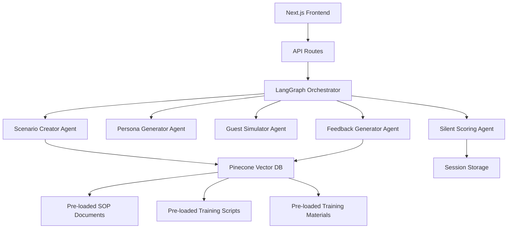
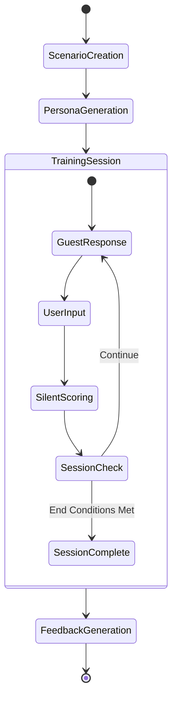

# AI Training Simulator Design Document

## Overview

The AI Training Simulator is built as a multi-agent system using LangGraph to orchestrate five specialized AI agents that work together to create immersive training experiences for STR virtual assistants. The system leverages the existing Next.js + LangGraph + Gemini architecture and extends it with Pinecone vector database integration for knowledge retrieval.

**Knowledge Base Setup**: Administrators pre-load all SOPs, training materials, and scripts into the Pinecone vector database during initial system setup. This knowledge base serves as the foundation for all training sessions.

The core workflow involves scenario creation, persona generation, real-time guest simulation, silent performance evaluation, and comprehensive feedback generation. Each agent retrieves relevant knowledge from the pre-loaded database as needed. The system maintains strict separation between the training experience (side panel) and feedback phase (main chat) to ensure immersion.

## Architecture

### High-Level System Architecture



### Agent Orchestration Flow



### Data Flow Architecture

The system uses a state-driven approach where each agent contributes to a shared state object that tracks:
- Current scenario and persona details
- Conversation history
- Silent scoring metrics
- Session completion status
- Retrieved knowledge context

## Components and Interfaces

### 1. LangGraph State Definition

```typescript
export const TrainingSimulatorState = Annotation.Root({
  ...MessagesAnnotation.spec,
  
  // Session Management
  sessionId: Annotation<string>,
  sessionStatus: Annotation<'creating' | 'active' | 'complete'>,
  
  // Scenario & Persona
  scenario: Annotation<ScenarioData>,
  persona: Annotation<PersonaData>,
  
  // Training Progress
  requiredSteps: Annotation<string[]>,
  completedSteps: Annotation<string[]>({
    default: () => [],
    reducer: (prev, update) => [...new Set([...prev, ...update])],
  }),
  
  // Silent Scoring
  scores: Annotation<ScoringMetrics>,
  criticalErrors: Annotation<string[]>({
    default: () => [],
    reducer: (prev, update) => prev.concat(update),
  }),
  
  // Knowledge Context
  retrievedContext: Annotation<string[]>({
    default: () => [],
    reducer: (prev, update) => prev.concat(update),
  }),
  
  // UI State
  currentEmotion: Annotation<string>,
  turnCount: Annotation<number>({
    default: () => 0,
    reducer: (prev, update) => prev + update,
  }),
});
```

### 2. Core Data Models

```typescript
interface ScenarioData {
  title: string;
  description: string;
  required_steps: string[];
  critical_errors: string[];
  time_pressure: number;
}

interface PersonaData {
  name: string;
  background: string;
  personality_traits: string[];
  hidden_motivations: string[];
  communication_style: string;
  emotional_arc: string[];
}

interface ScoringMetrics {
  policy_adherence: number;
  empathy_index: number;
  completeness: number;
  escalation_judgment: number;
  time_efficiency: number;
}

interface SessionData {
  id: string;
  scenario: ScenarioData;
  persona: PersonaData;
  conversation: Message[];
  scores: ScoringMetrics[];
  finalFeedback?: string;
  startTime: Date;
  endTime?: Date;
}
```

### 3. Agent Node Implementations

#### Scenario Creator Agent
- **Input**: Training objective, difficulty level
- **Process**: RAG query to Pinecone for relevant SOPs, scenario generation
- **Output**: Structured ScenarioData JSON
- **Temperature**: 0.3 (precise, policy-grounded)

#### Persona Generator Agent  
- **Input**: Scenario context, training objectives
- **Process**: Character design based on scenario requirements
- **Output**: Structured PersonaData JSON
- **Temperature**: 0.5 (balanced creativity and consistency)

#### Guest Simulator Agent
- **Input**: Persona data, conversation history, current emotion
- **Process**: Character-consistent response generation
- **Output**: Natural language response as the guest
- **Temperature**: 0.7 (creative, human-like responses)

#### Silent Scoring Agent
- **Input**: Latest user response, conversation context
- **Process**: Multi-dimensional evaluation against SOPs
- **Output**: Scoring metrics and session completion check
- **Temperature**: 0.1 (highly analytical and consistent)

#### Feedback Generator Agent
- **Input**: Complete session data, scoring history
- **Process**: RAG query for relevant SOPs, comprehensive analysis
- **Output**: Structured feedback with citations
- **Temperature**: 0.3 (precise, educational)

### 4. Pinecone Integration Layer

```typescript
interface PineconeService {
  // Admin functions (one-time setup)
  ingestSOPs(documents: Document[]): Promise<void>;
  ingestTrainingMaterials(materials: Document[]): Promise<void>;
  tagDocument(docId: string, metadata: DocumentMetadata): Promise<void>;
  
  // Runtime retrieval functions (used during training sessions)
  retrieveRelevantSOPs(query: string, filters?: MetadataFilter): Promise<RetrievalResult[]>;
  retrieveTrainingContent(scenario: string, difficulty: string): Promise<RetrievalResult[]>;
  searchPolicyGuidance(userResponse: string): Promise<RetrievalResult[]>;
}

interface DocumentMetadata {
  type: 'sop' | 'script' | 'best_practice';
  category: 'booking' | 'complaint' | 'overbooking' | 'general';
  difficulty: 'beginner' | 'intermediate' | 'advanced';
  tags: string[];
}
```

## Data Models

### Session Storage Schema

```typescript
// In-memory session store for active sessions
interface SessionStore {
  [sessionId: string]: {
    state: TrainingSimulatorState;
    startTime: Date;
    lastActivity: Date;
    isActive: boolean;
  };
}

// Persistent storage for completed sessions
interface CompletedSession {
  id: string;
  userId: string;
  scenario: ScenarioData;
  persona: PersonaData;
  transcript: Message[];
  finalScores: ScoringMetrics;
  feedback: string;
  duration: number;
  completedAt: Date;
}
```

### Vector Database Schema

```typescript
interface VectorDocument {
  id: string;
  content: string;
  embedding: number[];
  metadata: {
    source: string;
    type: 'sop' | 'script' | 'training_material';
    category: string;
    difficulty: string;
    section?: string;
    version: string;
    lastUpdated: Date;
  };
}
```

## Error Handling

### Agent Error Recovery
- **Scenario Creation Failures**: Fallback to template scenarios with basic SOP retrieval
- **Persona Generation Issues**: Default to neutral professional persona
- **Guest Simulator Errors**: Graceful degradation with simple acknowledgment responses
- **Scoring Agent Failures**: Continue session with warning, manual review flag
- **Feedback Generation Problems**: Provide basic performance summary with manual review

### Session Management Errors
- **Session Timeout**: Auto-save progress, allow resume within 24 hours
- **Connection Loss**: Client-side state persistence, automatic reconnection
- **Invalid State Transitions**: Reset to last valid state with user notification
- **Concurrent Session Conflicts**: Session locking with clear error messages

### External Service Failures
- **Pinecone Unavailability**: Cached fallback responses, degraded mode operation
- **Gemini API Limits**: Request queuing with user feedback, graceful backoff
- **Rate Limiting**: Intelligent retry with exponential backoff

## Testing Strategy

### Unit Testing
- **Agent Node Testing**: Mock LangGraph state, verify JSON output schemas
- **Pinecone Integration**: Mock vector operations, test retrieval accuracy
- **State Management**: Verify state transitions and reducer functions
- **Data Models**: Validate serialization/deserialization

### Integration Testing
- **Agent Orchestration**: End-to-end workflow testing with mock external services
- **API Endpoints**: Request/response validation, error handling verification
- **Session Management**: Multi-session concurrency testing
- **Vector Search**: Embedding quality and retrieval relevance testing

### User Experience Testing
- **Training Session Flow**: Complete scenario walkthroughs with various user inputs
- **UI State Management**: Side panel vs main chat transitions
- **Performance Testing**: Response time benchmarks, concurrent user limits
- **Accessibility**: Screen reader compatibility, keyboard navigation

### Evaluation Metrics
- **Scenario Quality**: Realism assessment by domain experts
- **Persona Consistency**: Character behavior evaluation across conversations
- **Scoring Accuracy**: Correlation with human evaluator assessments
- **Feedback Effectiveness**: Learning outcome measurements

### Test Data Management
- **Synthetic Training Data**: Generated scenarios and personas for testing
- **SOP Test Corpus**: Curated policy documents for retrieval testing
- **Conversation Samples**: Realistic VA-guest interactions for scoring validation
- **Performance Baselines**: Expected response times and accuracy thresholds