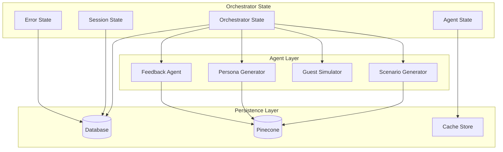
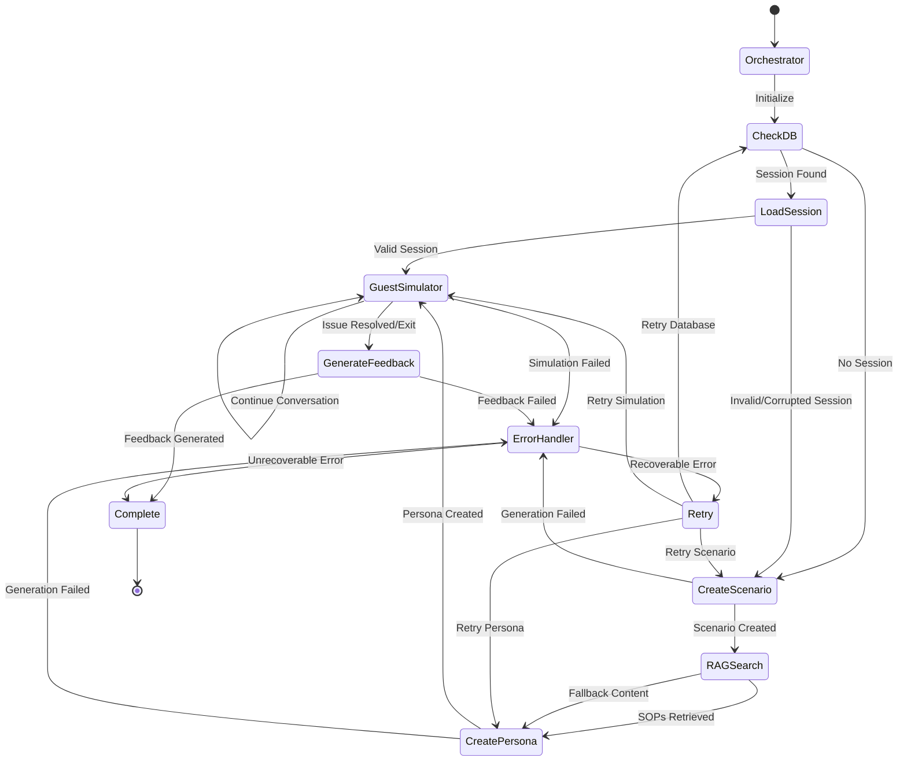

# Design Document

## Overview

The LangGraph orchestration system provides a centralized, stateful workflow management layer that coordinates all AI agents in the training simulator. This replaces the current linear workflow with a sophisticated state machine that handles session persistence, error recovery, and dynamic routing based on session state and user interactions.

The orchestrator acts as the central nervous system, managing the flow between scenario generation, persona creation, guest simulation, and feedback delivery while maintaining session state in the database and providing RAG-enhanced context to all agents.

## Architecture

### Core Components

#### 1. Orchestrator Node
- **Purpose**: Central coordinator that manages workflow state and routing decisions
- **Responsibilities**:
  - Session lifecycle management
  - State persistence and recovery
  - Error handling and retry logic
  - Agent coordination and data flow
  - Performance monitoring and logging

#### 2. Database Tool Call Node
- **Purpose**: Handles all database operations for session management
- **Responsibilities**:
  - Session existence checks
  - State persistence and retrieval
  - Training record management
  - Transaction handling and rollback

#### 3. RAG Search Node
- **Purpose**: Retrieves relevant SOPs and training materials from Pinecone
- **Responsibilities**:
  - Query optimization and embedding generation
  - Context filtering and ranking
  - Result formatting for downstream agents
  - Fallback content management

#### 4. Enhanced Agent Nodes
- **Guest_Scenario_Generator**: Creates training scenarios with RAG context
- **Guest_Persona_Generator**: Generates personas based on scenarios and SOPs
- **Guest_Simulator**: Maintains conversation state and persona consistency
- **Feedback_Agent**: Provides comprehensive analysis with SOP references

### State Management Architecture



### Workflow State Machine

The orchestrator implements a sophisticated state machine with the following states and transitions:



## Components and Interfaces

### 1. Orchestrator Interface

```typescript
interface OrchestratorState {
  sessionId: string;
  userId: string;
  currentNode: string;
  retryCount: number;
  errorHistory: ErrorRecord[];
  performance: PerformanceMetrics;
  context: OrchestrationContext;
}

interface OrchestrationContext {
  trainingObjective: string;
  difficultyLevel: 'Beginner' | 'Intermediate' | 'Advanced';
  ragContext: RAGContext;
  sessionMetadata: SessionMetadata;
}

interface ErrorRecord {
  timestamp: Date;
  node: string;
  error: string;
  recoverable: boolean;
  retryAttempt: number;
}
```

### 2. Database Tool Interface

```typescript
interface DatabaseTool {
  checkSessionExists(sessionId: string): Promise<SessionCheckResult>;
  loadSession(sessionId: string): Promise<TrainingSession | null>;
  saveSession(session: TrainingSession): Promise<void>;
  updateSessionState(sessionId: string, state: Partial<TrainingState>): Promise<void>;
  createTrainingRecord(training: TrainingRecord): Promise<string>;
  completeTraining(trainingId: string, results: TrainingResults): Promise<void>;
}

interface SessionCheckResult {
  exists: boolean;
  isValid: boolean;
  lastActivity: Date;
  status: 'active' | 'completed' | 'paused' | 'error';
}
```

### 3. RAG Search Interface

```typescript
interface RAGSearchTool {
  searchSOPs(query: string, filters: RAGFilters): Promise<RAGResult[]>;
  searchTrainingMaterials(scenario: string, difficulty: string): Promise<RAGResult[]>;
  searchPolicyGuidance(context: string): Promise<RAGResult[]>;
  buildContext(results: RAGResult[]): Promise<RAGContext>;
}

interface RAGFilters {
  category?: 'booking' | 'complaint' | 'overbooking' | 'general';
  difficulty?: 'beginner' | 'intermediate' | 'advanced';
  tags?: string[];
  maxResults?: number;
}

interface RAGContext {
  sops: FormattedSOP[];
  bestPractices: FormattedBestPractice[];
  scripts: FormattedScript[];
  contextSummary: string;
}
```

### 4. Enhanced Agent Interfaces

```typescript
interface EnhancedScenarioGenerator {
  generateScenario(
    objective: string, 
    difficulty: string, 
    ragContext: RAGContext
  ): Promise<ScenarioResult>;
}

interface EnhancedPersonaGenerator {
  generatePersona(
    scenario: Scenario, 
    ragContext: RAGContext
  ): Promise<PersonaResult>;
}

interface EnhancedGuestSimulator {
  simulateResponse(
    message: string, 
    sessionState: SimulationState
  ): Promise<SimulationResult>;
  
  evaluateConversation(
    conversation: Message[], 
    scenario: Scenario
  ): Promise<EvaluationResult>;
}

interface EnhancedFeedbackAgent {
  generateFeedback(
    conversation: Message[], 
    scores: ScoringMetrics, 
    ragContext: RAGContext
  ): Promise<FeedbackResult>;
}
```

## Data Models

### 1. Orchestrator State Model

```typescript
interface OrchestratorStateModel {
  id: string;
  sessionId: string;
  userId: string;
  currentNode: string;
  nodeHistory: NodeTransition[];
  retryCount: number;
  maxRetries: number;
  errorState: ErrorState | null;
  performance: PerformanceMetrics;
  createdAt: Date;
  updatedAt: Date;
}

interface NodeTransition {
  fromNode: string;
  toNode: string;
  timestamp: Date;
  duration: number;
  success: boolean;
  metadata?: Record<string, unknown>;
}
```

### 2. Enhanced Training Session Model

```typescript
interface EnhancedTrainingSession {
  id: string;
  userId: string;
  threadId: string;
  orchestratorState: OrchestratorStateModel;
  trainingState: TrainingState;
  ragContext: RAGContext;
  sessionMetadata: SessionMetadata;
  status: 'initializing' | 'active' | 'completed' | 'paused' | 'error';
  startedAt: Date;
  completedAt?: Date;
  lastActivity: Date;
}

interface SessionMetadata {
  userAgent: string;
  ipAddress: string;
  sessionDuration: number;
  messageCount: number;
  agentInvocations: AgentInvocation[];
  performanceMetrics: PerformanceMetrics;
}
```

### 3. RAG Context Model

```typescript
interface RAGContextModel {
  id: string;
  sessionId: string;
  sopResults: RAGResult[];
  trainingResults: RAGResult[];
  policyResults: RAGResult[];
  contextSummary: string;
  searchQueries: SearchQuery[];
  createdAt: Date;
  expiresAt: Date;
}

interface SearchQuery {
  query: string;
  filters: RAGFilters;
  resultCount: number;
  executionTime: number;
  timestamp: Date;
}
```

## Error Handling

### Error Classification System

```typescript
enum ErrorType {
  RECOVERABLE_AGENT_ERROR = 'recoverable_agent_error',
  UNRECOVERABLE_AGENT_ERROR = 'unrecoverable_agent_error',
  DATABASE_CONNECTION_ERROR = 'database_connection_error',
  RAG_SEARCH_ERROR = 'rag_search_error',
  SESSION_CORRUPTION_ERROR = 'session_corruption_error',
  TIMEOUT_ERROR = 'timeout_error',
  RATE_LIMIT_ERROR = 'rate_limit_error'
}

interface ErrorHandlingStrategy {
  errorType: ErrorType;
  maxRetries: number;
  retryDelay: number;
  fallbackAction: FallbackAction;
  escalationThreshold: number;
}
```

### Recovery Mechanisms

1. **Automatic Retry Logic**
   - Exponential backoff for transient errors
   - Circuit breaker pattern for external services
   - Graceful degradation with fallback content

2. **Session Recovery**
   - State reconstruction from database
   - Partial session recovery with user confirmation
   - Clean session restart as last resort

3. **Agent Fallback**
   - Default responses for agent failures
   - Cached content for RAG search failures
   - Simplified workflows for critical errors

## Testing Strategy

### 1. Unit Testing

```typescript
// Orchestrator unit tests
describe('Orchestrator', () => {
  test('should route to scenario generator for new sessions');
  test('should load existing session state correctly');
  test('should handle agent failures gracefully');
  test('should implement retry logic correctly');
});

// Database tool tests
describe('DatabaseTool', () => {
  test('should check session existence accurately');
  test('should handle concurrent session updates');
  test('should maintain data consistency');
});

// RAG search tests
describe('RAGSearchTool', () => {
  test('should retrieve relevant SOPs');
  test('should handle search failures gracefully');
  test('should format results correctly');
});
```

### 2. Integration Testing

```typescript
// End-to-end workflow tests
describe('Training Workflow Integration', () => {
  test('should complete full training session successfully');
  test('should handle session interruption and recovery');
  test('should maintain state consistency across nodes');
  test('should generate appropriate feedback');
});

// Database integration tests
describe('Database Integration', () => {
  test('should persist session state correctly');
  test('should handle database connection failures');
  test('should maintain referential integrity');
});
```

### 3. Performance Testing

```typescript
// Load testing scenarios
describe('Performance Tests', () => {
  test('should handle concurrent sessions efficiently');
  test('should maintain response times under load');
  test('should scale RAG searches appropriately');
  test('should manage memory usage effectively');
});
```

### 4. Error Simulation Testing

```typescript
// Chaos engineering tests
describe('Error Simulation', () => {
  test('should recover from database failures');
  test('should handle agent timeout scenarios');
  test('should manage RAG search failures');
  test('should maintain session integrity during errors');
});
```

## Performance Considerations

### 1. Caching Strategy
- **Session State Caching**: Redis-based caching for active sessions
- **RAG Result Caching**: Cache frequent search results with TTL
- **Agent Response Caching**: Cache common agent responses

### 2. Database Optimization
- **Connection Pooling**: Efficient database connection management
- **Query Optimization**: Indexed queries for session lookups
- **Batch Operations**: Bulk updates for performance metrics

### 3. Monitoring and Metrics
- **Real-time Dashboards**: Session status and performance metrics
- **Alert Systems**: Automated alerts for error thresholds
- **Performance Profiling**: Detailed timing analysis for optimization

### 4. Scalability Design
- **Horizontal Scaling**: Stateless orchestrator design
- **Load Balancing**: Distribute sessions across instances
- **Resource Management**: Dynamic resource allocation based on load