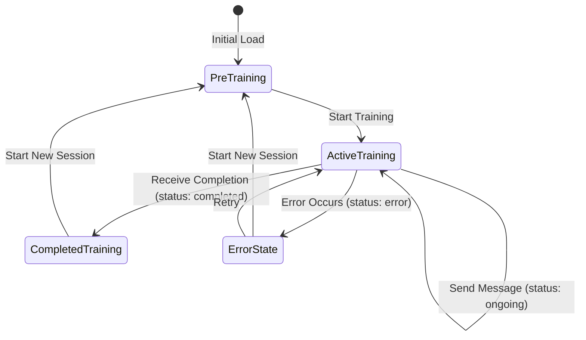

# Design Document

## Overview

This design enhances the existing training session UI to properly handle training completion states and display comprehensive feedback. The solution introduces state-driven UI rendering that responds to the `status` and `feedback` properties returned from `updateTrainingSession`, creating a seamless transition from active training to feedback review.

## Architecture

### State Management Enhancement

The main page component will be enhanced to track additional state:

- `trainingStatus: TrainingStateType` - Tracks current training state ('start' | 'ongoing' | 'completed' | 'error')
- `sessionFeedback: FeedbackSchema | null` - Stores feedback data when available
- `isSessionCompleted: boolean` - Computed property based on status

### UI State Transitions



## Components and Interfaces

### Enhanced Page Component State

```typescript
interface PageState {
  messages: BaseMessage[];
  isLoading: boolean;
  trainingStarted: boolean;
  trainingStatus: TrainingStateType;
  sessionFeedback: FeedbackSchema | null;
  scenario: ScenarioGeneratorSchema | null;
  persona: PersonaGeneratorSchema | null;
  customScenario: string;
  customPersona: string;
  isRefiningScenario: boolean;
  isRefiningPersona: boolean;
}
```

### New Components

#### 1. FeedbackPanel Component

```typescript
interface FeedbackPanelProps {
  feedback: FeedbackSchema;
  onStartNewSession: () => void;
}
```

**Responsibilities:**
- Display overall feedback summary
- Show critical message analysis with positive notes and constructive criticism
- List strengths and areas for improvement
- Provide general suggestions
- Include "Start New Training Session" CTA

#### 2. TrainingStatusIndicator Component

```typescript
interface TrainingStatusIndicatorProps {
  status: TrainingStateType;
  className?: string;
}
```

**Responsibilities:**
- Display visual status indicators
- Show appropriate icons and colors for each state
- Provide status-specific messaging

#### 3. CompletionFooter Component

```typescript
interface CompletionFooterProps {
  status: TrainingStateType;
  onStartNewSession: () => void;
  onRetry?: () => void;
}
```

**Responsibilities:**
- Replace MessageInput when training is completed or errored
- Show appropriate CTAs based on status
- Handle session reset functionality

## Data Models

### FeedbackSchema Structure

Based on the existing schema:

```typescript
interface FeedbackSchema {
  Overall_Feedback: string;
  Critical_Messages: Array<{
    index: number;
    Content: string;
    Positive_Notes: string[];
    Constructive_Criticism: string[];
  }>;
  Strengths: string[];
  Areas_For_Improvement: string[];
  General_Suggestions: string[];
}
```

### TrainingStateType

```typescript
type TrainingStateType = 'start' | 'ongoing' | 'completed' | 'error';
```

## Error Handling

### Error State Management

- Display user-friendly error messages
- Provide retry mechanisms for recoverable errors
- Maintain error context for debugging
- Graceful fallback to new session creation

### Error UI States

1. **Network Errors**: Show retry button with error message
2. **Validation Errors**: Display specific validation feedback
3. **Unknown Errors**: Generic error message with new session option

## Testing Strategy

### Component Testing

1. **FeedbackPanel Tests**
   - Renders feedback data correctly
   - Handles missing feedback gracefully
   - CTA functionality works properly

2. **TrainingStatusIndicator Tests**
   - Shows correct status for each state
   - Visual indicators match status
   - Accessibility compliance

3. **Page Component Integration Tests**
   - State transitions work correctly
   - UI updates based on status changes
   - Message handling in different states

### User Flow Testing

1. **Complete Training Flow**
   - Start training → Active chat → Completion → Feedback display
   - Verify UI transitions at each step
   - Test new session creation from completion state

2. **Error Handling Flow**
   - Simulate various error conditions
   - Verify appropriate error UI displays
   - Test recovery mechanisms

## Implementation Details

### State Update Logic

```typescript
const handleSendMessage = async (content: string) => {
  // ... existing logic ...
  
  const result = await updateTrainingSession({
    scenario,
    guestPersona: persona,
    messages: updatedMessages,
  });

  // New status handling
  setTrainingStatus(result.status);
  
  if (result.feedback) {
    setSessionFeedback(result.feedback);
  }

  // Conditional UI updates based on status
  if (result.status === 'completed') {
    // Disable further input, show feedback
  } else if (result.status === 'error') {
    // Show error state
  }
};
```

### UI Rendering Logic

```typescript
const renderFooter = () => {
  if (!trainingStarted) return null;
  
  if (trainingStatus === 'completed' || trainingStatus === 'error') {
    return (
      <CompletionFooter 
        status={trainingStatus}
        onStartNewSession={handleStartNewSession}
        onRetry={trainingStatus === 'error' ? handleRetry : undefined}
      />
    );
  }
  
  return (
    <MessageInput
      onSendMessage={handleSendMessage}
      disabled={isLoading}
      placeholder="Type your message to the guest..."
    />
  );
};
```

### Session Reset Functionality

```typescript
const handleStartNewSession = () => {
  setMessages([]);
  setTrainingStarted(false);
  setTrainingStatus('start');
  setSessionFeedback(null);
  setScenario(null);
  setPersona(null);
  setCustomScenario('');
  setCustomPersona('');
};
```

## Visual Design Considerations

### Feedback Panel Layout

- Card-based layout with clear sections
- Color-coded feedback (green for strengths, amber for improvements)
- Expandable sections for detailed message analysis
- Prominent CTA button for new session

### Status Indicators

- Subtle status bar or badge
- Color coding: blue (ongoing), green (completed), red (error)
- Icons to reinforce status meaning
- Smooth transitions between states

### Responsive Design

- Feedback panel adapts to screen size
- Mobile-friendly feedback display
- Collapsible sections on smaller screens