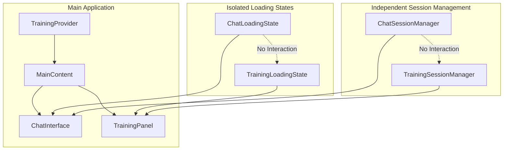

# Design Document

## Overview

This design addresses the isolation issues between training sessions and normal chat sessions in the AI Training Simulator. Currently, the loading states and session management are intertwined, causing confusion and interference between the two modes. The solution involves creating separate loading state management, independent UI indicators, and isolated session contexts.

## Architecture

### Current State Issues

Based on code analysis, the current implementation has several isolation problems:

1. **Shared Loading State**: Both training and chat use the same `isLoading` state from TrainingContext
2. **Cross-contamination**: Training session status affects main chat UI display
3. **Mixed Loading Indicators**: No visual distinction between training vs chat loading
4. **Session Interference**: Training session state changes affect main chat behavior

### Proposed Architecture



## Components and Interfaces

### 1. Loading State Isolation

#### ChatLoadingContext
```typescript
interface ChatLoadingState {
  isLoading: boolean;
  loadingMessage?: string;
  error?: string;
}

interface ChatLoadingContextType {
  state: ChatLoadingState;
  setLoading: (loading: boolean, message?: string) => void;
  setError: (error?: string) => void;
  clearError: () => void;
}
```

#### TrainingLoadingContext
```typescript
interface TrainingLoadingState {
  isLoading: boolean;
  loadingType: 'session-start' | 'message-send' | 'status-check' | null;
  loadingMessage?: string;
  error?: string;
}

interface TrainingLoadingContextType {
  state: TrainingLoadingState;
  setLoading: (loading: boolean, type?: 'session-start' | 'message-send' | 'status-check', message?: string) => void;
  setError: (error?: string) => void;
  clearError: () => void;
}
```

### 2. Enhanced TrainingContext

#### Modified TrainingUIState
```typescript
export interface TrainingUIState {
  // Remove isLoading - will be handled by TrainingLoadingContext
  phase: TrainingPhase;
  activeSessionId?: string;
  completedSessionId?: string;
  sessionStatus?: SessionStatus;
  scenario?: ScenarioData;
  persona?: PersonaData;
  scores?: ScoringMetrics & { overall: number };
  progress: {
    currentTurn: number;
    completedSteps: string[];
    requiredSteps: string[];
    completionPercentage: number;
  };
  sessionDuration: number;
  startTime?: Date;
  error?: AppError; // Training-specific errors only
  isPanelFrozen: boolean;
  showFeedback: boolean;
  criticalErrors: string[];
}
```

### 3. Loading Indicator Components

#### ChatLoadingIndicator
```typescript
interface ChatLoadingIndicatorProps {
  className?: string;
}

// Displays chat-specific loading with distinct styling
const ChatLoadingIndicator: React.FC<ChatLoadingIndicatorProps>
```

#### TrainingLoadingIndicator
```typescript
interface TrainingLoadingIndicatorProps {
  type?: 'session-start' | 'message-send' | 'status-check';
  className?: string;
}

// Displays training-specific loading with distinct styling and type-specific messages
const TrainingLoadingIndicator: React.FC<TrainingLoadingIndicatorProps>
```

### 4. Session Management Isolation

#### ChatSessionManager
```typescript
interface ChatSessionManager {
  conversationHistory: ChatMessage[];
  addMessage: (message: ChatMessage) => void;
  clearHistory: () => void;
  sendMessage: (message: string) => Promise<void>;
  // No dependency on training state
}
```

#### TrainingSessionManager
```typescript
interface TrainingSessionManager {
  startSession: (config: TrainingConfig) => Promise<string>;
  sendMessage: (sessionId: string, message: string) => Promise<void>;
  getSessionStatus: (sessionId: string) => Promise<SessionStatus>;
  // No dependency on chat state
}
```

## Data Models

### Loading State Models

```typescript
// Chat Loading States
type ChatLoadingType = 'message-send' | 'conversation-load';

interface ChatLoadingState {
  isLoading: boolean;
  type?: ChatLoadingType;
  message?: string;
  error?: string;
  timestamp?: Date;
}

// Training Loading States  
type TrainingLoadingType = 'session-start' | 'message-send' | 'status-check' | 'session-complete';

interface TrainingLoadingState {
  isLoading: boolean;
  type?: TrainingLoadingType;
  message?: string;
  error?: string;
  timestamp?: Date;
  progress?: number; // For session start progress
}
```

### UI State Models

```typescript
// Isolated UI states
interface ChatUIState {
  isActive: boolean; // Whether chat is the active interface
  hasError: boolean;
  messageCount: number;
}

interface TrainingUIState {
  isActive: boolean; // Whether training is the active interface
  hasError: boolean;
  sessionPhase: TrainingPhase;
}
```

## Error Handling

### Isolated Error Management

1. **Chat Errors**: Only affect chat interface, don't propagate to training
2. **Training Errors**: Only affect training panel, don't propagate to chat
3. **Error Display**: Separate error components for each context
4. **Error Recovery**: Independent retry mechanisms

```typescript
// Chat Error Handler
interface ChatErrorHandler {
  handleError: (error: Error) => void;
  retryLastAction: () => Promise<void>;
  clearError: () => void;
}

// Training Error Handler  
interface TrainingErrorHandler {
  handleError: (error: Error) => void;
  retryLastAction: () => Promise<void>;
  clearError: () => void;
}
```

## Verification Strategy

### Code Review and Linting

1. **Loading State Isolation Verification**
   - Review code to ensure chat loading doesn't affect training state
   - Review code to ensure training loading doesn't affect chat state
   - Verify through code inspection that concurrent loading scenarios are handled

2. **Session Management Verification**
   - Review independent session lifecycle management through code inspection
   - Verify no cross-contamination between sessions through static analysis
   - Review error isolation implementation

3. **UI Component Verification**
   - Review loading indicator visual distinction through code inspection
   - Verify proper loading state display in correct areas through component analysis
   - Review error display isolation implementation

### Manual Verification

1. **Full Isolation Verification**
   - Manually verify starting training while chat is active works correctly
   - Manually verify sending chat messages while training is loading works correctly
   - Manually verify independent error handling through browser testing

2. **Concurrent Operation Verification**
   - Manually verify both systems loading simultaneously
   - Manually verify both systems with errors simultaneously
   - Manually verify state transitions in both systems

**Note: This implementation should NOT use any testing frameworks or automated testing commands. Verification should be done through code review, linting, and manual browser testing only.**

## Implementation Phases

### Phase 1: Loading State Separation
- Create ChatLoadingContext and TrainingLoadingContext
- Remove shared loading state from TrainingContext
- Update components to use appropriate loading contexts

### Phase 2: UI Indicator Isolation
- Create distinct loading indicator components
- Update ChatInterface to use ChatLoadingIndicator
- Update TrainingPanel to use TrainingLoadingIndicator

### Phase 3: Session Management Isolation
- Refactor session management to be independent
- Remove cross-dependencies between chat and training
- Implement isolated error handling

### Phase 4: Manual Validation
- Manual verification of isolation in all scenarios
- Code review and linting validation
- Manual browser testing for concurrent operations

## Success Criteria

1. **Complete Loading State Isolation**
   - Training loading never affects chat interface
   - Chat loading never affects training interface
   - Visual indicators appear only in appropriate areas

2. **Independent Session Management**
   - Chat sessions operate independently of training
   - Training sessions operate independently of chat
   - No state leakage between systems

3. **Clear Visual Distinction**
   - Users can immediately identify which system is loading
   - Loading states are visually distinct and contextual
   - No confusion about system status

4. **Robust Error Handling**
   - Errors in one system don't affect the other
   - Independent error recovery mechanisms
   - Clear error attribution to correct system