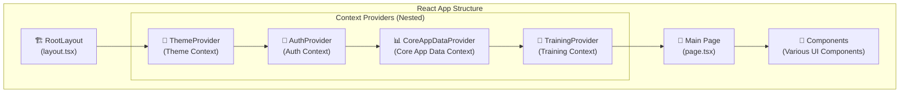
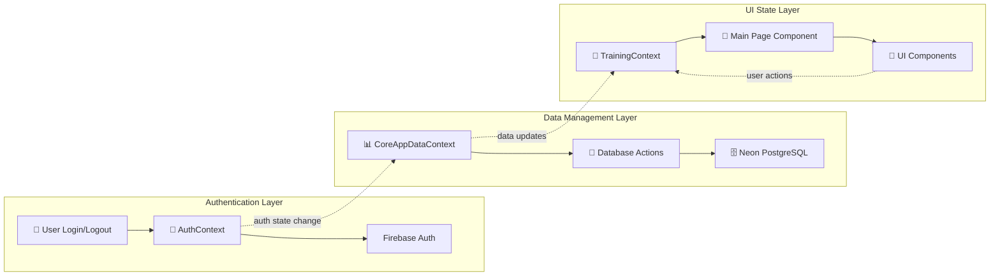

# Context Architecture Diagram

## High-Level Context Hierarchy



## Context Interaction Flow



## Detailed Data Flow Architecture

```
┌─────────────────────────────────────────────────────────────────────────────────┐
│                            🏗️ React Application Architecture                      │
└─────────────────────────────────────────────────────────────────────────────────┘

┌─────────────────────┐    ┌─────────────────────┐    ┌─────────────────────┐
│   🎨 ThemeContext    │    │   🔐 AuthContext     │    │📊 CoreAppDataContext│
│                     │    │                     │    │                     │
│ • theme: string     │    │ • user: AuthUser    │───▶│ • threads: Thread[] │
│ • actualTheme       │    │ • isAuthenticated   │    │ • trainings: []     │
│ • setTheme()        │    │ • isLoading         │    │ • activeTraining    │
│                     │    │ • signIn/Out()      │    │ • userProfile       │
│ Storage:            │    │                     │    │                     │
│ └── localStorage    │    │ Storage:            │    │ Storage:            │
└─────────────────────┘    │ └── Firebase        │    │ └── Neon Database   │
                           └─────────────────────┘    └─────────────────────┘
                                      │                         ▲
                                      │                         │
                                      ▼                         │
                           ┌─────────────────────────────────────┘
                           │     Auth State Change Listener
                           │     useEffect(() => {
                           │       if (authState.user) {
                           │         loadUserData(userId)
                           │       } else {
                           │         clearAppData()
                           │       }
                           │     }, [authState.user])

┌─────────────────────────────────────────────────────────────────────────────────┐
│                          🎯 TrainingContext (UI State)                          │
├─────────────────────────────────────────────────────────────────────────────────┤
│                                                                                 │
│  Training Session State:              UI State:                                │
│  • messages: BaseMessage[]            • isLoading: boolean                     │
│  • scenario: ScenarioSchema           • errorMessage: string                   │
│  • persona: PersonaSchema             • panelWidth: number                     │
│  • trainingStatus: string             • isResizing: boolean                    │
│  • sessionFeedback: FeedbackSchema    • lastFailedMessage: string             │
│                                                                                 │
│  Integration with CoreAppDataContext:                                          │
│  ┌─────────────────────────────────────────────────────────────────────────┐   │
│  │  useEffect(() => {                                                      │   │
│  │    if (trainingStarted && authState.user && !activeThreadId) {         │   │
│  │      // Create thread in database via CoreAppDataContext               │   │
│  │      const thread = await startNewTrainingSession(title, scenario, persona) │
│  │      setActiveThreadId(thread.id)                                      │   │
│  │    }                                                                    │   │
│  │  }, [trainingStarted, authState.user])                                │   │
│  └─────────────────────────────────────────────────────────────────────────┘   │
│                                                                                 │
│  Enhanced Methods:                                                              │
│  • addMessage() → also saves to DB if user logged in                          │
│  • resetSession() → clears both UI state and activeThreadId                   │
│  • finalizeTraining() → completes training session in DB                      │
│                                                                                 │
└─────────────────────────────────────────────────────────────────────────────────┘
```

## User Journey Flow Diagrams

### 1. Anonymous User Flow
```
👤 Anonymous User
    │
    ├── 🎯 Start Training Session
    │   ├── TrainingContext creates in-memory state
    │   ├── No database interaction
    │   └── Full functionality available
    │
    ├── 💬 Send Messages
    │   ├── Messages stored in TrainingContext state
    │   └── No persistence beyond browser session
    │
    └── 🎯 End Session
        ├── Get feedback and results
        ├── Data lost on page refresh
        └── No historical tracking
```

### 2. Authenticated User Flow
```
🔐 Authenticated User
    │
    ├── 🔑 Login Event
    │   ├── AuthContext updates user state
    │   ├── CoreAppDataContext detects auth change
    │   └── Auto-loads user's past training sessions
    │
    ├── 🎯 Start Training Session
    │   ├── TrainingContext creates UI state
    │   ├── CoreAppDataContext creates Thread in database
    │   └── Links UI state with database record
    │
    ├── 💬 Send Messages  
    │   ├── Messages stored in TrainingContext (immediate UI)
    │   ├── Automatically saved to database via CoreAppDataContext
    │   └── Full message history preserved
    │
    ├── 🎯 Complete Session
    │   ├── TrainingContext triggers completion
    │   ├── CoreAppDataContext saves final scores/feedback
    │   └── Thread marked as 'completed' in database
    │
    └── 📊 View Past Sessions
        ├── CoreAppDataContext loads user's training history
        ├── Access to all previous sessions and scores
        └── Analytics and progress tracking available
```

## Database Schema Integration

```
┌─────────────────────────────────────────────────────────────────────────────────┐
│                          🗄️ Database Schema Relationships                        │
└─────────────────────────────────────────────────────────────────────────────────┘

    Firebase Auth (uid)
            │
            │ 1:1 relationship
            ▼
    ┌─────────────────┐
    │     👤 User      │
    │   (Neon DB)     │────┐
    │ • id (UUID)     │    │
    │ • createdAt     │    │ 1:Many relationship
    │ • updatedAt     │    │
    │ • deletedAt     │    ▼
    └─────────────────┘    ┌─────────────────────────┐
            │              │      🧵 Thread           │
            │              │   (Training Session)    │
            │ 1:Many       │ • id (UUID)             │
            ▼              │ • title                 │
    ┌─────────────────┐    │ • userId (FK)           │
    │   🔐 UserAuth    │    │ • scenario (JSON)      │
    │   (Auth Methods)│    │ • persona (JSON)       │
    │ • userId (FK)   │    │ • status (enum)        │
    │ • provider      │    │ • score (JSON)         │
    │ • email         │    │ • feedback (JSON)      │
    │ • providerUserId│    │ • startedAt            │
    └─────────────────┘    │ • completedAt          │
                          └─────────────────────────┘
                                      │
                                      │ 1:Many relationship
                                      ▼
                          ┌─────────────────────────┐
                          │     💬 Message          │
                          │                         │
                          │ • id (UUID)             │
                          │ • chatId (FK to Thread) │
                          │ • role ('AI'/'trainee') │
                          │ • parts (JSON content)  │
                          │ • attachments (JSON)    │
                          │ • isTraining (boolean)  │
                          │ • createdAt             │
                          └─────────────────────────┘
```

## Event Flow Sequence

```
User Action: "Start Training Session"
┌─────────────────────────────────────────────────────────────────────────────────┐
│ Sequence of Events:                                                             │
├─────────────────────────────────────────────────────────────────────────────────┤
│                                                                                 │
│ 1. 📄 Main Page Component                                                       │
│    └── handleStartTraining() called                                            │
│                                                                                 │
│ 2. 🎯 TrainingContext                                                           │
│    ├── setTrainingStarted(true)                                               │
│    ├── setScenario(scenario)                                                  │
│    └── setPersona(persona)                                                    │
│                                                                                 │
│ 3. ⚡ useEffect Trigger (in TrainingContext)                                   │
│    └── Detects: trainingStarted + authState.user + no activeThreadId         │
│                                                                                 │
│ 4. 📊 CoreAppDataContext                                                        │
│    ├── startNewTrainingSession() called                                       │
│    ├── createThread() database action                                         │
│    ├── Updates local trainings state                                          │
│    └── Returns thread.id                                                      │
│                                                                                 │
│ 5. 🎯 TrainingContext (continued)                                              │
│    └── setActiveThreadId(thread.id)                                          │
│                                                                                 │
│ 6. 💬 User Sends Message                                                       │
│    ├── TrainingContext.addMessage() - immediate UI update                     │
│    └── addMessageToTrainingSession() - database persistence                   │
│                                                                                 │
│ 7. 🎯 Training Completion                                                      │
│    ├── setSessionFeedback(feedback) - TrainingContext                        │
│    ├── finalizeTraining() triggered by useEffect                             │
│    └── completeTrainingSession() - CoreAppDataContext → Database             │
│                                                                                 │
└─────────────────────────────────────────────────────────────────────────────────┘
```

## Context Responsibilities Matrix

| Context | Purpose | State Management | Data Persistence | Dependencies |
|---------|---------|------------------|------------------|--------------|
| **🎨 ThemeContext** | UI theme management | `useState` | localStorage | None |
| **🔐 AuthContext** | Authentication | `useReducer` | Firebase Auth | Firebase SDK |
| **📊 CoreAppDataContext** | App data & DB sync | `useReducer` | Neon Database | AuthContext |
| **🎯 TrainingContext** | Training UI state | `useState` | None (delegates to Core) | AuthContext, CoreAppDataContext |

## Error Handling Flow

```
Error Scenarios and Handling:

┌─────────────────┐    ┌─────────────────┐    ┌─────────────────┐
│ Authentication  │    │ Database Ops    │    │ Training Logic  │
│ Errors          │    │ Errors          │    │ Errors          │
├─────────────────┤    ├─────────────────┤    ├─────────────────┤
│ • Network fails │    │ • DB connection │    │ • AI agent fails│
│ • Invalid creds │    │ • Query errors  │    │ • Invalid input │
│ • Token expired │    │ • Constraint    │    │ • Timeout       │
│                 │    │   violations    │    │                 │
│ Handled by:     │    │                 │    │ Handled by:     │
│ AuthContext     │    │ Handled by:     │    │ TrainingContext │
│ ↓               │    │ CoreAppData     │    │ ↓               │
│ Error UI shown  │    │ Context         │    │ Error state     │
│ Retry options   │    │ ↓               │    │ Retry mechanism │
│                 │    │ Graceful        │    │                 │
│                 │    │ degradation     │    │                 │
│                 │    │ (continue       │    │                 │
│                 │    │ in-memory)      │    │                 │
└─────────────────┘    └─────────────────┘    └─────────────────┘
```

This architecture provides:

1. **Clear Separation of Concerns**: Each context has a specific responsibility
2. **Reactive Data Flow**: Changes in auth state automatically trigger data loading/clearing  
3. **Progressive Enhancement**: Anonymous users get full functionality, authenticated users get persistence
4. **Error Resilience**: Each layer handles its own errors gracefully
5. **Scalable Structure**: Easy to add new features without breaking existing functionality

The key insight is that `CoreAppDataContext` acts as the bridge between authentication state and application data, while `TrainingContext` focuses purely on UI state management for the current session.