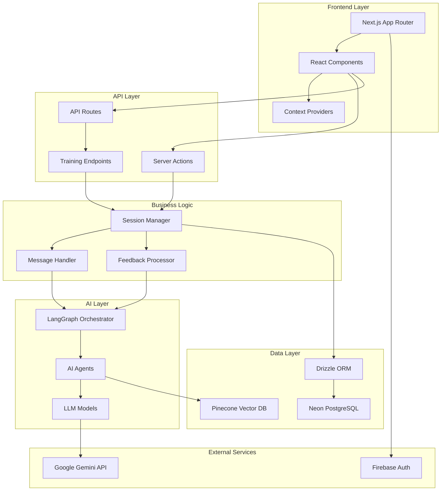
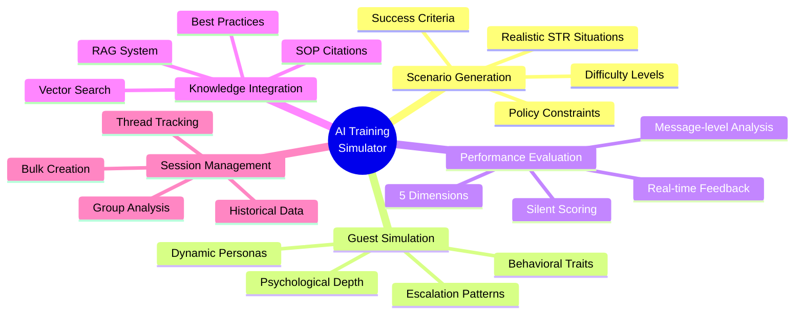
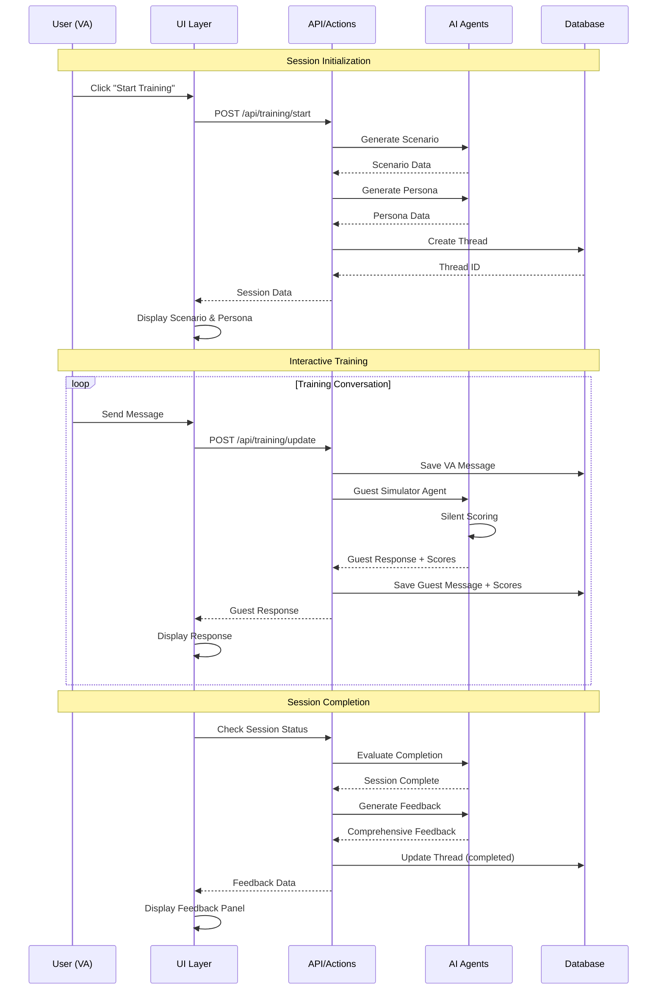
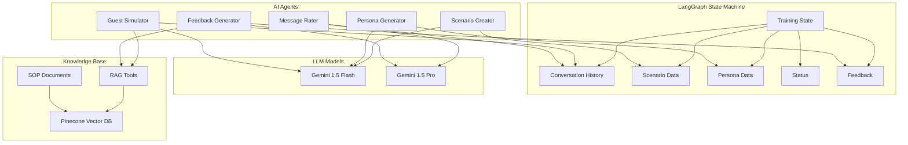
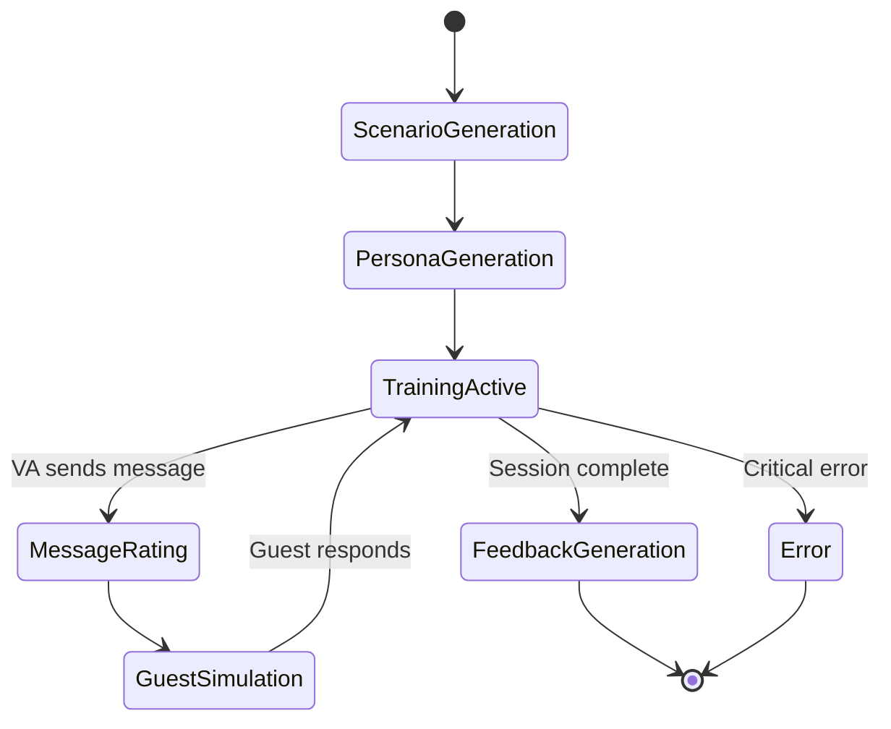
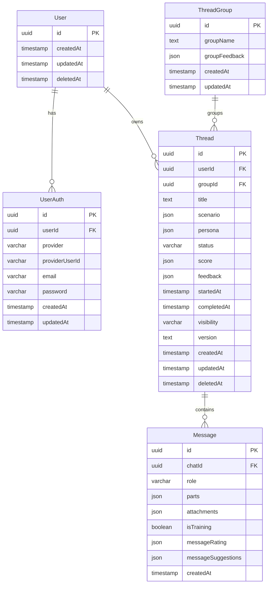
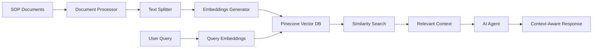
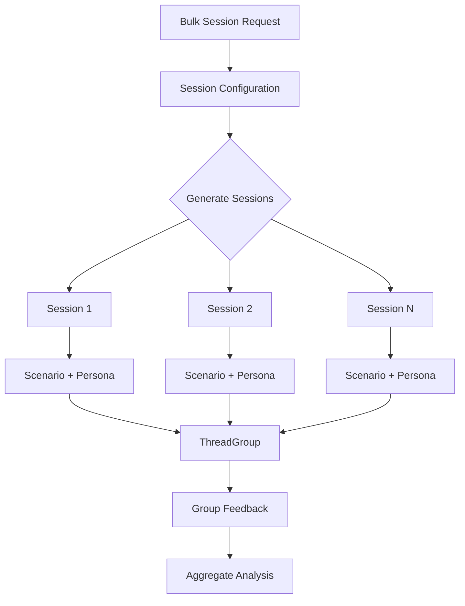

# AI Training Simulator for STR Virtual Assistants

An AI-powered training platform that creates realistic scenarios for Short-Term Rental (STR) virtual assistants to practice handling guest interactions in a safe, simulated environment.

## Overview

This platform uses advanced AI orchestration to generate dynamic training scenarios where VAs interact with simulated guests. The system provides real-time performance evaluation and comprehensive feedback to improve VA skills in handling bookings, complaints, and challenging situations.

### System Architecture



## Key Features



**Core Capabilities:**

- **AI-Generated Scenarios**: Realistic STR situations with specific objectives and difficulty levels
- **Dynamic Guest Personas**: Psychologically authentic guest personalities with unique traits and behaviors
- **Silent Performance Scoring**: Real-time evaluation across 5 dimensions without breaking immersion
- **Comprehensive Feedback**: Post-session analysis with actionable recommendations and SOP citations
- **RAG-Powered Knowledge**: Integration with company policies and training materials via vector search
- **Multi-Agent Workflow**: LangGraph-orchestrated AI agents for scenario creation, persona generation, and guest simulation

## Tech Stack

### Core Framework
- **Next.js 15.5.0** - App Router with Turbopack
- **React 19.1.0** - Server and client components
- **TypeScript 5** - Strict mode for type safety

### AI/ML
- **LangChain 0.3.31** - AI orchestration framework
- **LangGraph 0.4.6** - State machine for multi-agent workflows
- **Google Gemini** - LLM provider (gemini-1.5-flash, gemini-1.5-pro)
- **Pinecone** - Vector database for RAG implementation

### Database
- **Neon PostgreSQL** - Serverless PostgreSQL database
- **Drizzle ORM 0.44.5** - Type-safe database queries
- **Drizzle Kit 0.31.4** - Schema migrations

### UI
- **Tailwind CSS v4** - Utility-first styling
- **Radix UI** - Accessible component primitives
- **shadcn/ui** - Pre-built component library
- **Lucide React** - Icon library

### Authentication
- **Firebase 12.2.1** - Client-side authentication
- **Firebase Admin 13.5.0** - Server-side auth verification

### Testing
- **Vitest 3.2.4** - Unit and integration testing
- **Testing Library** - React component testing

## Project Structure

```
src/app/
├── adapters/          # External service adapters (Firebase)
├── api/               # API route handlers
│   ├── messages/      # Message CRUD operations
│   ├── threads/       # Thread management
│   ├── threadgroups/  # Thread group operations
│   └── training/      # Training session endpoints
├── auth/              # Authentication pages
├── components/        # React components
│   ├── ui/           # Base UI components (shadcn/ui)
│   └── examples/     # Example implementations
├── contexts/          # React Context providers
├── hooks/             # Custom React hooks
└── lib/               # Core business logic
    ├── actions/       # Next.js Server Actions
    ├── agents/        # AI agent implementations
    │   └── v2/       # Current agent version
    ├── api/          # API client utilities
    ├── db/           # Database schema and queries
    │   └── actions/  # Database operations
    ├── rag-tools/    # RAG and document processing
    ├── types/        # TypeScript type definitions
    └── utils/        # Utility functions
```

## Getting Started

### Prerequisites

- Node.js 20+
- pnpm (package manager)
- PostgreSQL database (Neon recommended)
- Google Gemini API key
- Pinecone account
- Firebase project

### Installation

1. Clone the repository:
```bash
git clone <repository-url>
cd <project-directory>
```

2. Install dependencies:
```bash
pnpm install
```

3. Set up environment variables:
Create a `.env.local` file with the following:
```env
# Google Gemini
GOOGLE_API_KEY=your_gemini_api_key

# Pinecone
PINECONE_API_KEY=your_pinecone_api_key
PINECONE_INDEX_NAME=your_index_name

# Database
DATABASE_URL=your_neon_postgres_url

# Firebase (client)
NEXT_PUBLIC_FIREBASE_API_KEY=your_firebase_api_key
NEXT_PUBLIC_FIREBASE_AUTH_DOMAIN=your_auth_domain
NEXT_PUBLIC_FIREBASE_PROJECT_ID=your_project_id
NEXT_PUBLIC_FIREBASE_STORAGE_BUCKET=your_storage_bucket
NEXT_PUBLIC_FIREBASE_MESSAGING_SENDER_ID=your_sender_id
NEXT_PUBLIC_FIREBASE_APP_ID=your_app_id

# Firebase Admin
FIREBASE_ADMIN_PROJECT_ID=your_project_id
FIREBASE_ADMIN_CLIENT_EMAIL=your_client_email
FIREBASE_ADMIN_PRIVATE_KEY=your_private_key
```

4. Set up the database:
```bash
pnpm db:generate  # Generate migrations
pnpm db:push      # Push schema to database
```

5. Start the development server:
```bash
pnpm dev
```

The application will be available at `http://localhost:3000`.

## Available Commands

```bash
# Development
pnpm dev              # Start dev server with Turbopack
pnpm build            # Build for production
pnpm start            # Start production server

# Database
pnpm db:generate      # Generate migrations
pnpm db:push          # Push schema changes
pnpm db:studio        # Open Drizzle Studio

# Testing
pnpm test             # Run tests in watch mode
pnpm test:run         # Run tests once
pnpm test:ui          # Open Vitest UI

# Code Quality
pnpm lint             # Run ESLint
```

## Core Workflows

### Training Session Flow



**Flow Stages:**

1. **Session Initialization**
   - User starts a training session
   - AI generates a realistic scenario with specific objectives
   - AI creates a guest persona with psychological depth

2. **Interactive Training**
   - VA interacts with the simulated guest via chat
   - AI guest responds dynamically based on persona and VA's messages
   - Silent scoring evaluates performance in real-time

3. **Session Completion**
   - Training concludes when objectives are met or time expires
   - System generates comprehensive feedback
   - Performance scores across multiple dimensions

4. **Feedback Review**
   - Detailed analysis of VA performance
   - Specific message-level feedback
   - Actionable recommendations with SOP citations

### General Chat Mode

- Ask questions about training concepts
- Get performance insights
- Review historical training data
- Access knowledge base via RAG

## AI Agent Architecture

The system uses a multi-agent architecture orchestrated by LangGraph:



### Agent Workflow



### Agents

1. **Scenario Creator Agent**
   - Generates realistic STR scenarios
   - Defines objectives and success criteria
   - Sets difficulty levels (Easy, Medium, Hard)
   - Uses Gemini 1.5 Flash for fast generation

2. **Persona Generator Agent**
   - Creates psychologically authentic guest personas
   - Defines personality traits and communication styles
   - Establishes emotional tones and expectations
   - Includes escalation behaviors

3. **Guest Simulator Agent**
   - Simulates guest responses in real-time
   - Maintains persona consistency throughout conversation
   - Adapts behavior based on VA interactions
   - Uses RAG for context-aware responses

4. **Message Rating Agent**
   - Evaluates individual VA messages
   - Scores across 5 dimensions (policy, empathy, problem-solving, quality, overall)
   - Provides silent performance tracking
   - Uses Gemini 1.5 Pro for accurate evaluation

5. **Feedback Generator Agent**
   - Analyzes complete training sessions
   - Provides message-level feedback with specific examples
   - Generates actionable recommendations
   - Cites relevant SOPs and best practices

### State Management

The system uses LangGraph's state machine to manage:
- **Conversation History**: All messages with roles and content
- **Scenario Data**: Current training scenario details
- **Persona Data**: Guest persona characteristics
- **Training Status**: start → ongoing → completed/error/paused
- **Performance Scores**: Real-time evaluation metrics
- **Feedback**: Post-session comprehensive analysis

## Database Schema



### Core Tables

- **User**: User identity and profile information
- **UserAuth**: Authentication methods (email, Google, GitHub, etc.)
- **Thread**: Training session conversations with scenario, persona, and results
- **Message**: Individual chat messages with AI ratings and suggestions
- **ThreadGroup**: Grouped training sessions for bulk operations and cohort training

## Key Features in Detail

### Silent Performance Scoring

The system evaluates VA performance across 5 dimensions:
- Policy adherence
- Empathy and communication
- Problem-solving effectiveness
- Response quality
- Overall performance

Scoring happens in real-time without interrupting the training flow.

### RAG Integration



**Features:**
- Vector search powered by Pinecone
- Integration with company SOPs and training materials
- Context-aware responses and feedback
- Document processing and chunking utilities
- Semantic search for relevant policy citations

### Bulk Session Creation



**Features:**
- Create multiple training sessions at once
- Group related sessions for cohort training
- Aggregate feedback across session groups
- Batch scenario and persona generation
- Comparative performance analysis

## Development Guidelines

### Import Aliases

- `@/*` - Root src directory
- `@/app/*` - App directory
- `@/components/*` - Components directory
- `@/lib/*` - Lib directory

### Conventions

- **Components**: PascalCase (e.g., `TrainingPanel.tsx`)
- **Utilities**: kebab-case (e.g., `message-feedback-handler.ts`)
- **Actions**: kebab-case with suffix (e.g., `training-actions.ts`)
- **Server Actions**: Preferred over API routes for type-safe operations
- **Styling**: Tailwind CSS with `cn()` utility for conditional classes

## Testing

The project uses Vitest for testing:

```bash
pnpm test        # Watch mode
pnpm test:run    # Single run
pnpm test:ui     # Visual UI
```

Test files should be co-located with the code they test or in a `__tests__` directory.

## Documentation

Additional documentation is available in the `docs/` directory:

- `ARCHITECTURE_REALITY_CHECK.md` - Current implementation status
- `INTERACTION_FLOW_DOCUMENTATION.md` - Component interaction patterns
- `TRAINING_PANEL_DOCUMENTATION.md` - Training panel architecture
- `PAGE_DOCUMENTATION.md` - Main page structure
- `SERVER_ACTIONS_MIGRATION.md` - API migration guide

## Contributing

1. Follow the existing code structure and conventions
2. Write tests for new features
3. Update documentation as needed
4. Use TypeScript strict mode
5. Follow the component organization patterns

## License

[Add your license information here]

## Support

[Add support contact information here]
