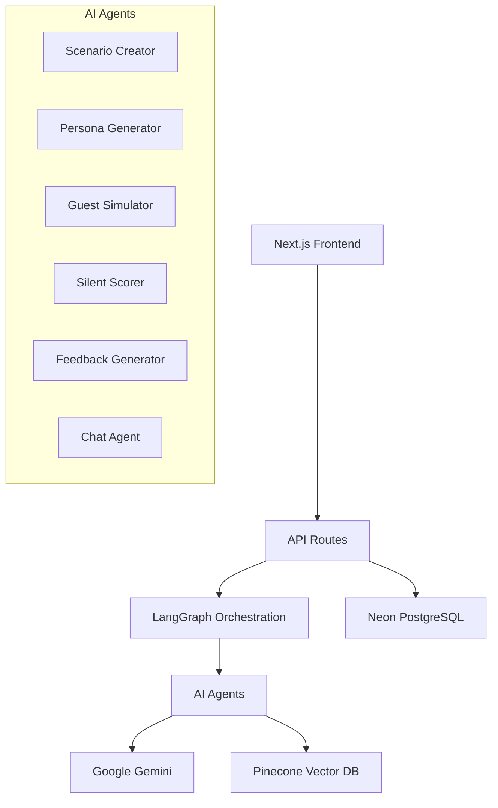

# AI Training Simulator for STR Virtual Assistants

A comprehensive AI-powered training platform designed specifically for Short-Term Rental (STR) virtual assistants. The system creates realistic training scenarios where VAs interact with simulated guests to practice handling various situations like bookings, complaints, and overbookings in a safe, controlled environment.

## 🎯 Overview

This platform transforms traditional training methods by providing:
- **Realistic Scenario Generation**: AI creates authentic STR scenarios with specific objectives
- **Dynamic Guest Personas**: AI-generated guest personalities with psychological depth
- **Silent Performance Scoring**: Real-time evaluation without breaking immersion
- **Comprehensive Feedback**: Post-session analysis with SOP citations and actionable recommendations
- **Knowledge Integration**: RAG-powered system using company policies and training materials

## 🏗️ Architecture

### High-Level System Design



### Core Components

#### 1. **Frontend Architecture (Next.js 15 + React 19)**
- **App Router**: Modern routing with server/client components
- **Context Management**: React Context + useReducer for state management
- **Component System**: shadcn/ui + Radix UI for accessible components
- **Real-time Updates**: Polling-based session status updates
- **Responsive Design**: Tailwind CSS v4 for styling

#### 2. **AI Agent Orchestration (LangGraph)**
- **Scenario Creator**: Generates realistic STR scenarios based on training objectives
- **Persona Generator**: Creates detailed guest personas with emotional arcs
- **Guest Simulator**: Simulates guest interactions with personality-driven responses
- **Silent Scorer**: Evaluates performance across 5 dimensions without user awareness
- **Feedback Generator**: Provides comprehensive post-session analysis
- **Chat Agent**: Handles general conversations and performance discussions

#### 3. **Knowledge Management (Pinecone + RAG)**
- **Vector Database**: Stores SOPs, training materials, and best practices
- **Semantic Search**: Retrieves relevant context for scenario generation
- **Policy Guidance**: Real-time SOP lookup during scoring and feedback

#### 4. **Data Layer (Neon PostgreSQL + Drizzle ORM)**
- **Session Management**: Tracks training sessions and progress
- **User Analytics**: Stores performance metrics and trends
- **Content Storage**: Manages scenarios, personas, and feedback data

## 🚀 Getting Started

### Prerequisites

- **Node.js** 18+ with pnpm
- **Google AI API Key** (Gemini)
- **Pinecone API Key** (Vector Database)
- **Neon Database** (PostgreSQL)

### Installation

1. **Clone the repository**
   ```bash
   git clone <repository-url>
   cd ai-training-simulator
   ```

2. **Install dependencies**
   ```bash
   pnpm install
   ```

3. **Environment Setup**
   ```bash
   cp .env.example .env
   ```
   
   Configure your `.env` file:
   ```env
   # AI Configuration
   GOOGLE_API_KEY=your_gemini_api_key
   
   # Vector Database
   PINECONE_API_KEY=your_pinecone_api_key
   PINECONE_INDEX_NAME=training-simulator
   
   # Database
   DATABASE_URL=your_neon_database_url
   
   # Optional: Development
   NODE_ENV=development
   ```

4. **Database Setup**
   ```bash
   pnpm db:push    # Push schema to database
   pnpm db:seed    # Seed with sample data (optional)
   ```

5. **Start Development Server**
   ```bash
   pnpm dev
   ```

   Visit `http://localhost:3000` to access the application.

## 📖 Usage Guide

### For Virtual Assistants (Trainees)

1. **Start Training Session**
   - Click "Start Training Session" in the main interface
   - AI generates a personalized scenario based on your skill level
   - Training panel opens with scenario details and guest persona

2. **Interactive Training**
   - Respond to the AI guest in the training panel
   - Main chat area shows session status and progress
   - Silent scoring tracks your performance in real-time

3. **Receive Feedback**
   - Session completes automatically when objectives are met
   - Detailed feedback appears in the main chat area
   - Review performance metrics, strengths, and improvement areas

4. **General Chat**
   - Use the main chat for questions about training
   - Get performance insights and personalized recommendations
   - Access historical session data and trends

### For Administrators

1. **Content Management**
   - Upload SOPs and training materials to Pinecone
   - Configure scenario templates and difficulty levels
   - Monitor system performance and user analytics

2. **Performance Analytics**
   - Track trainee progress across sessions
   - Identify common problem areas
   - Generate reports on training effectiveness

## 🛠️ Development

### Project Structure

```
src/app/
├── api/                    # API routes
│   ├── chat/              # General chat endpoints
│   └── training/          # Training session endpoints
├── components/            # React components
│   ├── ui/               # Base UI components (shadcn/ui)
│   ├── ChatInterface.tsx # Main chat interface
│   ├── TrainingPanel.tsx # Training session panel
│   └── FeedbackInterface.tsx # Feedback display
├── contexts/             # React Context providers
│   ├── TrainingContext.tsx # Training state management
│   └── ThemeContext.tsx   # Theme management
└── lib/                  # Core business logic
    ├── agents/           # AI agent implementations
    ├── db/              # Database schema and queries
    ├── actions/         # Server actions
    └── types.ts         # TypeScript definitions
```

### Key Technologies

- **Framework**: Next.js 15.5.0 with App Router and Turbopack
- **Runtime**: React 19.1.0 with TypeScript
- **AI/ML**: LangChain + LangGraph + Google Gemini
- **Vector DB**: Pinecone for RAG implementation
- **Database**: Neon PostgreSQL with Drizzle ORM
- **UI**: Tailwind CSS v4 + Radix UI + shadcn/ui
- **Testing**: Vitest + Testing Library

### Development Commands

```bash
# Development
pnpm dev              # Start dev server with Turbopack
pnpm build            # Build for production
pnpm start            # Start production server

# Database
pnpm db:generate      # Generate migrations
pnpm db:push          # Push schema changes
pnpm db:studio        # Open Drizzle Studio

# Testing
pnpm test             # Run tests in watch mode
pnpm test:run         # Run tests once
pnpm test:ui          # Open Vitest UI

# Code Quality
pnpm lint             # Run ESLint
pnpm type-check       # Run TypeScript checks
```

### Adding New Features

1. **New AI Agent**
   ```typescript
   // src/app/lib/agents/new-agent.ts
   export async function newAgent(state: TrainingState) {
     // Agent implementation
   }
   ```

2. **New Component**
   ```typescript
   // src/app/components/NewComponent.tsx
   export const NewComponent: React.FC<Props> = ({ ... }) => {
     // Component implementation
   }
   ```

3. **Database Schema Changes**
   ```typescript
   // src/app/lib/db/schema.ts
   export const newTable = pgTable("new_table", {
     // Schema definition
   });
   ```

## 🧪 Testing

### Test Structure

```
src/
├── __tests__/            # Integration tests
├── components/
│   └── __tests__/       # Component tests
└── lib/
    └── __tests__/       # Unit tests
```

### Running Tests

```bash
# All tests
pnpm test

# Specific test file
pnpm test TrainingPanel.test.tsx

# Coverage report
pnpm test:coverage

# UI mode
pnpm test:ui
```

## 🚀 Deployment

### Production Build

```bash
pnpm build
pnpm start
```

### Environment Variables (Production)

```env
NODE_ENV=production
GOOGLE_API_KEY=your_production_gemini_key
PINECONE_API_KEY=your_production_pinecone_key
DATABASE_URL=your_production_database_url
```

### Deployment Platforms

- **Vercel**: Recommended for Next.js applications
- **Railway**: Good for full-stack applications
- **Docker**: Container deployment option

## 📊 Performance Monitoring

### Key Metrics

- **Session Completion Rate**: Percentage of started sessions completed
- **Average Session Duration**: Time spent in training sessions
- **Performance Improvement**: Score trends over time
- **User Engagement**: Frequency of training sessions

### Monitoring Tools

- **Application**: Built-in analytics dashboard
- **Infrastructure**: Vercel Analytics or custom monitoring
- **Database**: Neon monitoring dashboard
- **AI Usage**: Google AI Studio usage tracking

## 🔧 Configuration

### AI Agent Configuration

```typescript
// src/app/lib/service-interfaces.ts
export const AGENT_CONFIGS = {
  scenarioCreator: {
    model: "gemini-1.5-flash",
    temperature: 0.7,
    maxTokens: 2000
  },
  guestSimulator: {
    model: "gemini-1.5-pro",
    temperature: 0.8,
    maxTokens: 1000
  }
  // ... other agents
};
```

### Database Configuration

```typescript
// drizzle.config.ts
export default {
  schema: "./src/app/lib/db/schema.ts",
  out: "./drizzle",
  driver: "pg",
  dbCredentials: {
    connectionString: process.env.DATABASE_URL!
  }
};
```

## 🤝 Contributing

1. **Fork the repository**
2. **Create a feature branch**: `git checkout -b feature/new-feature`
3. **Make changes and test**: `pnpm test`
4. **Commit changes**: `git commit -m "Add new feature"`
5. **Push to branch**: `git push origin feature/new-feature`
6. **Create Pull Request**

### Code Standards

- **TypeScript**: Strict mode enabled
- **ESLint**: Next.js configuration
- **Prettier**: Code formatting
- **Conventional Commits**: Commit message format

## 📝 License

This project is licensed under the MIT License - see the [LICENSE](LICENSE) file for details.

## 🆘 Support

- **Documentation**: Check the `/docs` folder for detailed guides
- **Issues**: Report bugs via GitHub Issues
- **Discussions**: Use GitHub Discussions for questions
- **Email**: Contact the development team

## 🗺️ Roadmap

### Current Features ✅
- AI-powered scenario generation
- Real-time guest simulation
- Silent performance scoring
- Comprehensive feedback system
- RAG-based knowledge integration

### Planned Features 🚧
- Multi-language support
- Advanced analytics dashboard
- Custom scenario templates
- Team management features
- Mobile application
- Voice interaction support
- Integration with existing LMS platforms

### Future Enhancements 🔮
- VR/AR training environments
- Advanced AI coaching
- Predictive performance analytics
- Industry-specific modules
- API for third-party integrations

---

**Built with ❤️ for the STR industry**