# Complete Interaction Flow Documentation

## Overview
This document provides a comprehensive view of how `page.tsx` and `TrainingPanel.tsx` interact with each other and the broader application ecosystem.

## Complete System Architecture

### High-Level System Overview
```mermaid
graph TB
    subgraph "Application Layer"
        A[page.tsx - MainContent]
        B[TrainingPanel.tsx]
        C[FeedbackInterface.tsx]
    end
    
    subgraph "Context Layer"
        D[TrainingContext]
        E[ChatLoadingContext]
    end
    
    subgraph "Manager Layer"
        F[TrainingSessionManager]
        G[ChatSessionManager]
    end
    
    subgraph "API Layer"
        H[/api/training/start]
        I[/api/training/update]
    end
    
    A --> D
    A --> E
    A --> F
    A --> G
    B --> D
    B --> F
    
    F --> H
    F --> I
    
    A -.-> B
    A -.-> C
    
    Note: TrainingLoadingContext and /api/training/status removed
```

## Complete Training Session Flow

### End-to-End Training Session Journey
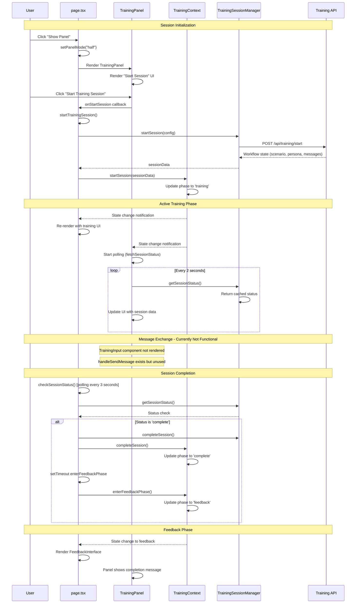

## State Synchronization Patterns

### Context State Flow Between Components
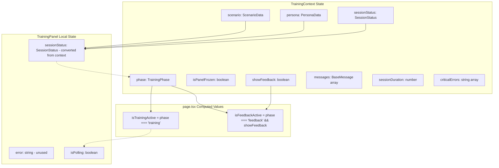

### Loading State Management
```mermaid
graph TB
    subgraph "ChatLoadingContext"
        A[Chat Operations Only]
        B[message-send type]
    end
    
    subgraph "page.tsx Usage"
        C[Chat Loading UI]
        D[Conditional Loading Display]
    end
    
    subgraph "TrainingPanel Usage"
        E[Loading Skeleton Display]
        F[TrainingLoadingIndicator]
    end
    
    A --> C
    B --> C
    
    Note: No dedicated TrainingLoadingContext
    Note: Training loading handled via conditional rendering
    
    D --> E
    D --> F
```

## Error Handling Coordination

### Multi-Layer Error Handling
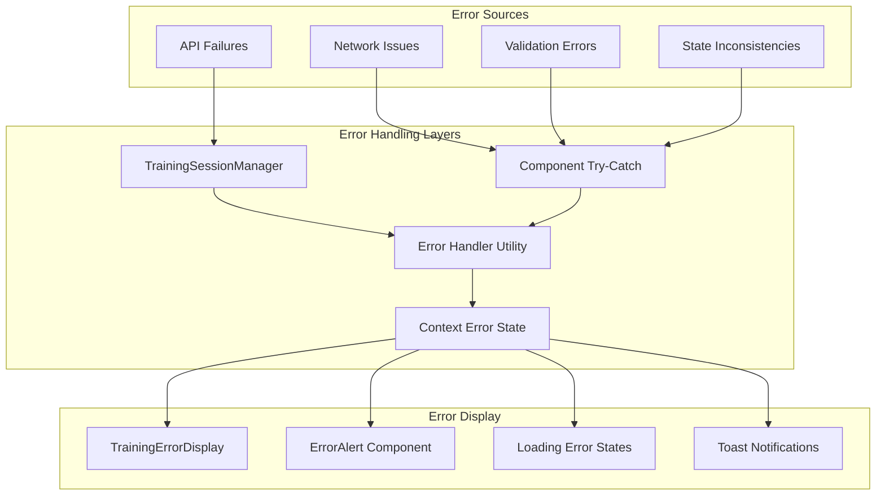

### Error Recovery Flow
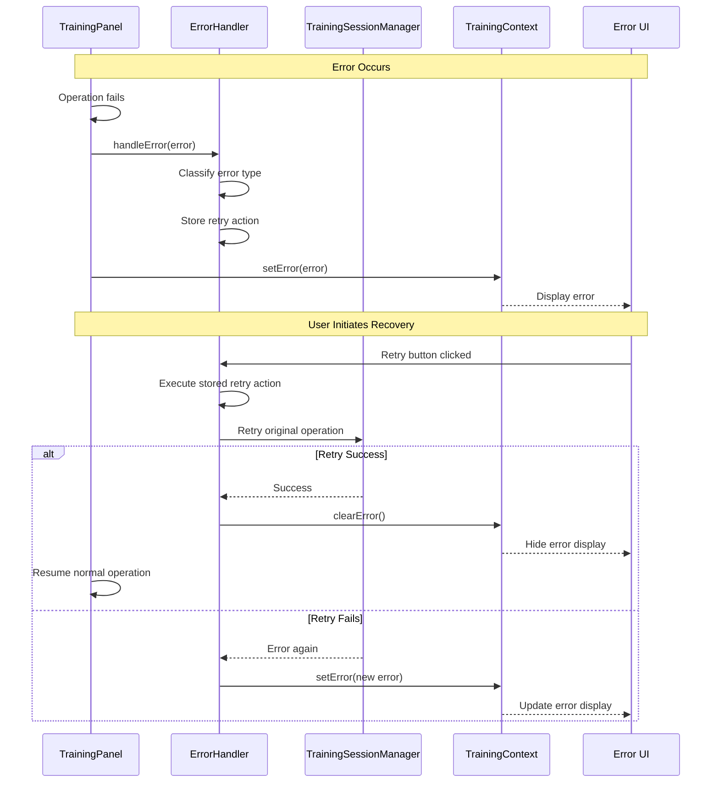

## Component Lifecycle Interactions

### Mount/Unmount Coordination
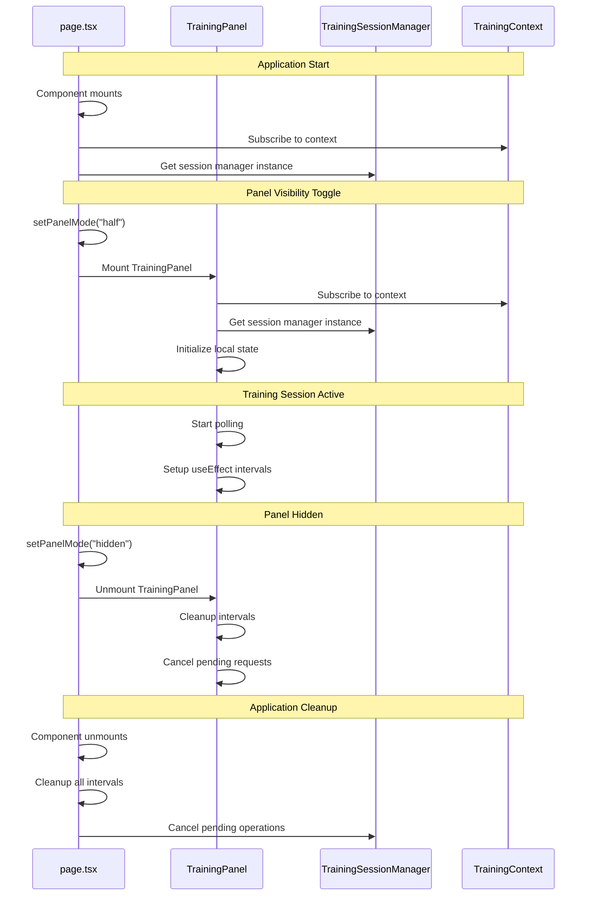

## Data Flow Patterns

### Session Data Propagation
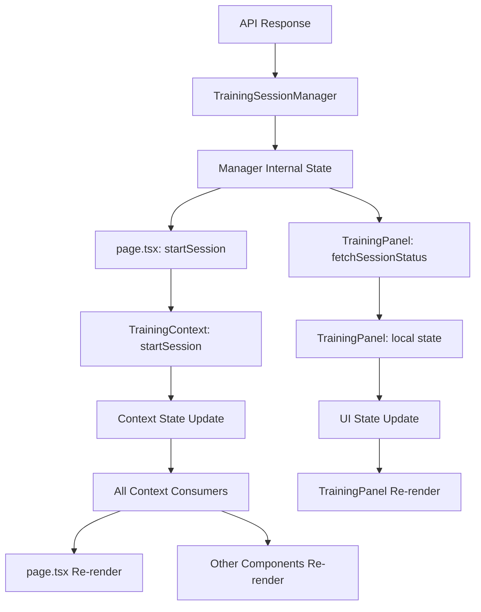

### Message Flow Architecture
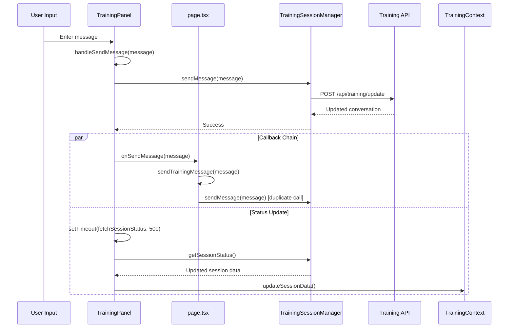

## Performance Optimization Strategies

### Re-render Optimization
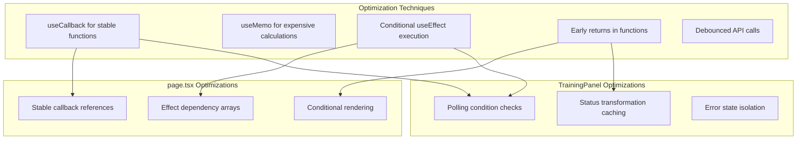

### Memory Management
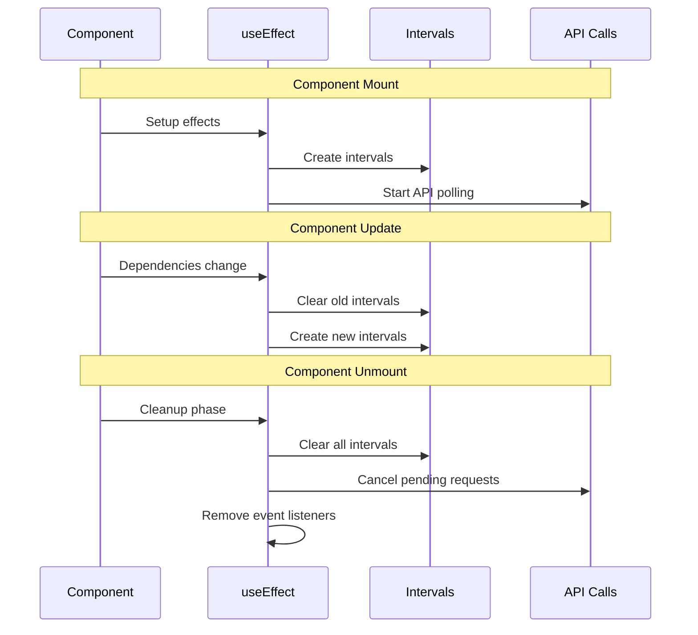

## Testing Integration Points

### Cross-Component Testing Strategy
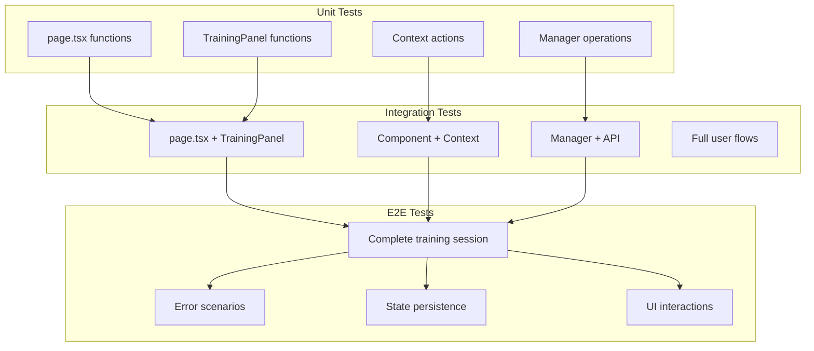

### Mock Strategy for Integration
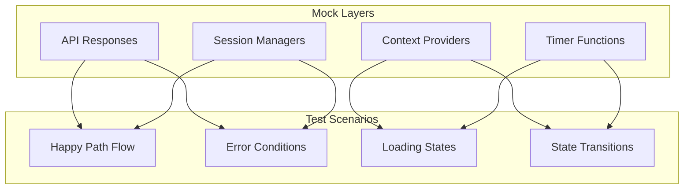

## Key Architectural Decisions

### 1. Separation of Concerns
- **page.tsx**: Orchestrates overall application state and layout
- **TrainingPanel**: Handles training-specific interactions and polling
- **Contexts**: Manage shared state and provide actions
- **Managers**: Encapsulate business logic and API interactions

### 2. Communication Patterns
- **Props**: For direct parent-child communication
- **Callbacks**: For child-to-parent event notification
- **Context**: For shared state and actions across components
- **Managers**: For centralized business logic

### 3. State Management Strategy
- **Local State**: Component-specific UI state
- **Context State**: Shared application state
- **Manager State**: Business logic state with API synchronization

### 4. Error Handling Philosophy
- **Graceful Degradation**: UI remains functional during errors
- **User Feedback**: Clear error messages and recovery options
- **Retry Logic**: Automatic and manual retry mechanisms
- **Error Isolation**: Errors in one area don't break others

## Current Limitations and Missing Features

### 1. Incomplete TrainingPanel Implementation
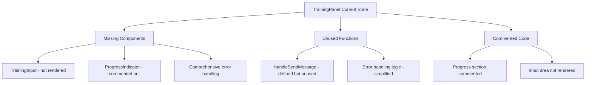

### 2. Missing Context Integration
- **TrainingLoadingContext**: Referenced in documentation but doesn't exist
- **Simplified Error Handling**: No dedicated error handler utility
- **No Progress Tracking**: Progress-related functionality is commented out

### 3. Incomplete Message Flow
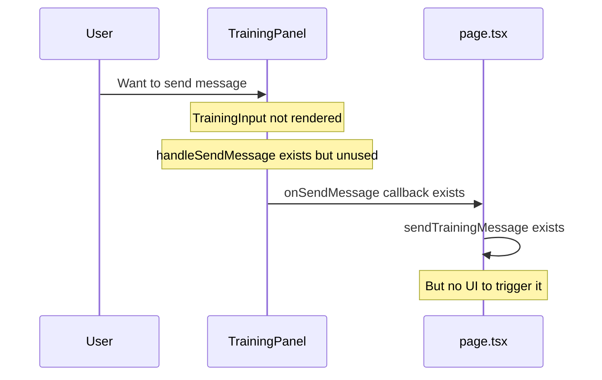

### 4. Session Status Management
- **Status Polling**: Works but only returns cached status
- **No Real Status Updates**: getSessionStatus() doesn't actually check server
- **Manual Completion**: Sessions don't automatically complete based on conversation

This interaction model provides the foundation for training session management, but several key features need implementation to make it fully functional.