# Page.tsx Documentation

## Overview
The `page.tsx` file is the main entry point for the AI Training Simulator application. It implements a React component architecture using Provider Pattern, Context API, Custom Hooks, and State Management patterns. **Note: The TrainingLoadingProvider mentioned in some diagrams does not exist in the current codebase.**

## Architecture Overview

### High-Level Component Structure
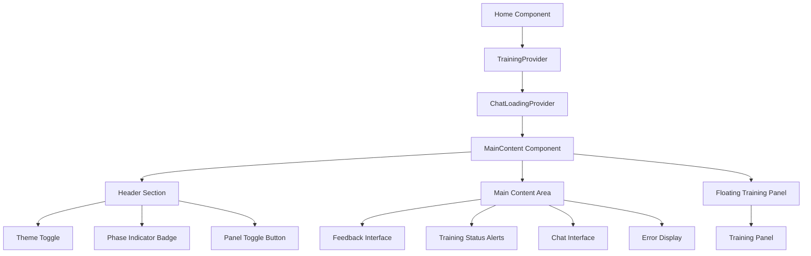

## Design Patterns Implemented

### 1. Provider Pattern (Context API)
The application uses two context providers to manage different aspects of state:

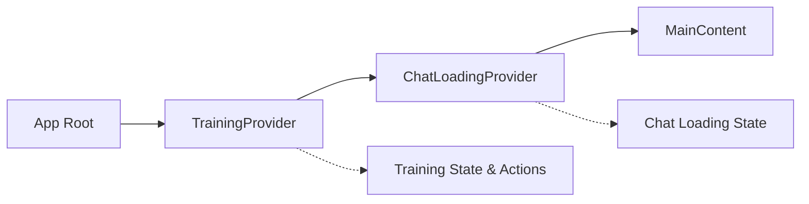

**Implementation Details:**
- **TrainingProvider**: Manages training session state, phase transitions, session data, and all training-related actions
- **ChatLoadingProvider**: Handles loading states specifically for chat operations

### 2. Custom Hooks Pattern
Two custom hooks encapsulate complex logic:

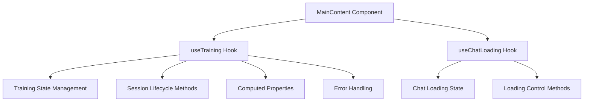

### 3. Manager Pattern (Session Management)
Two separate manager instances handle different concerns:

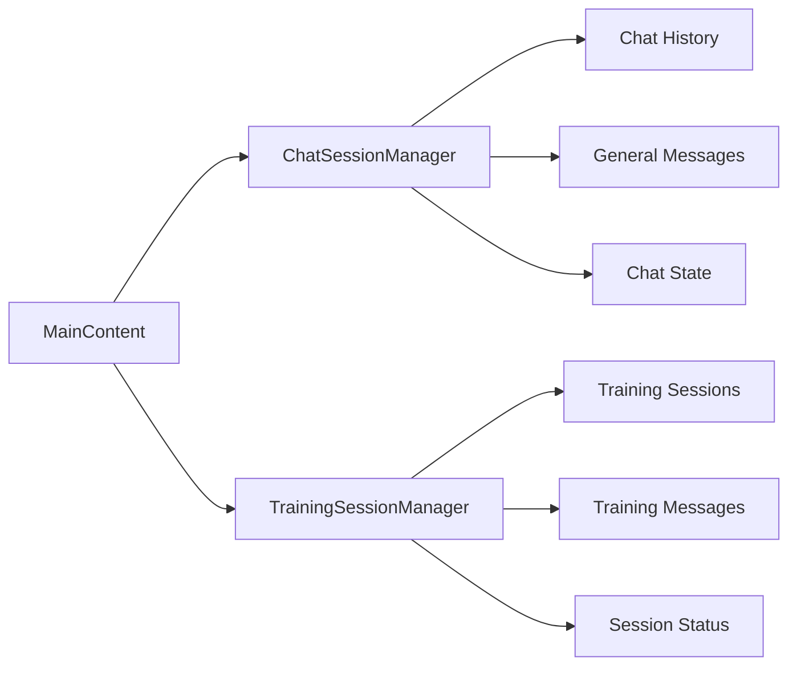

## Component State Flow

### Training Session Lifecycle
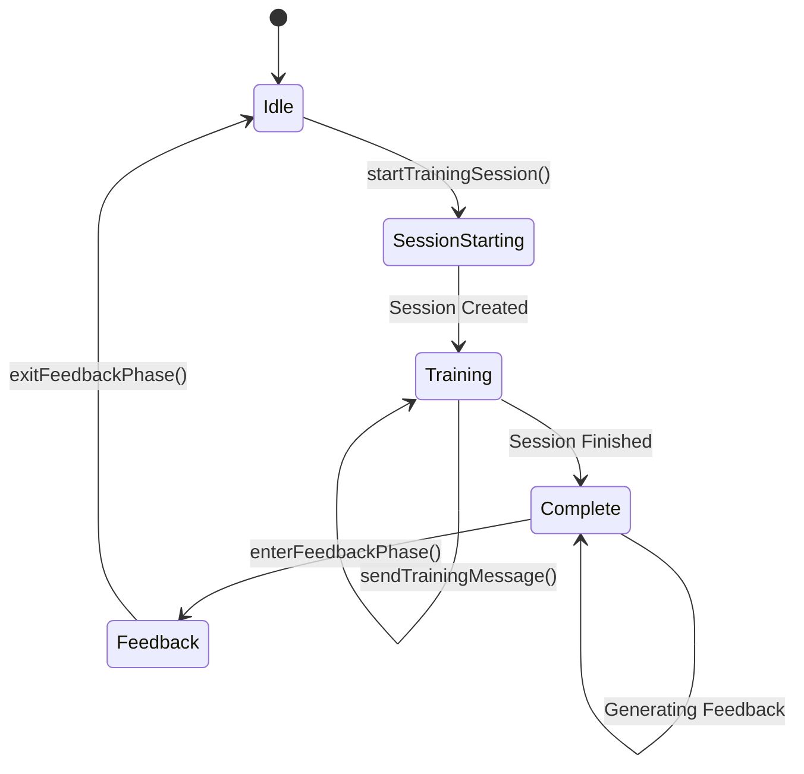

### State Management Flow
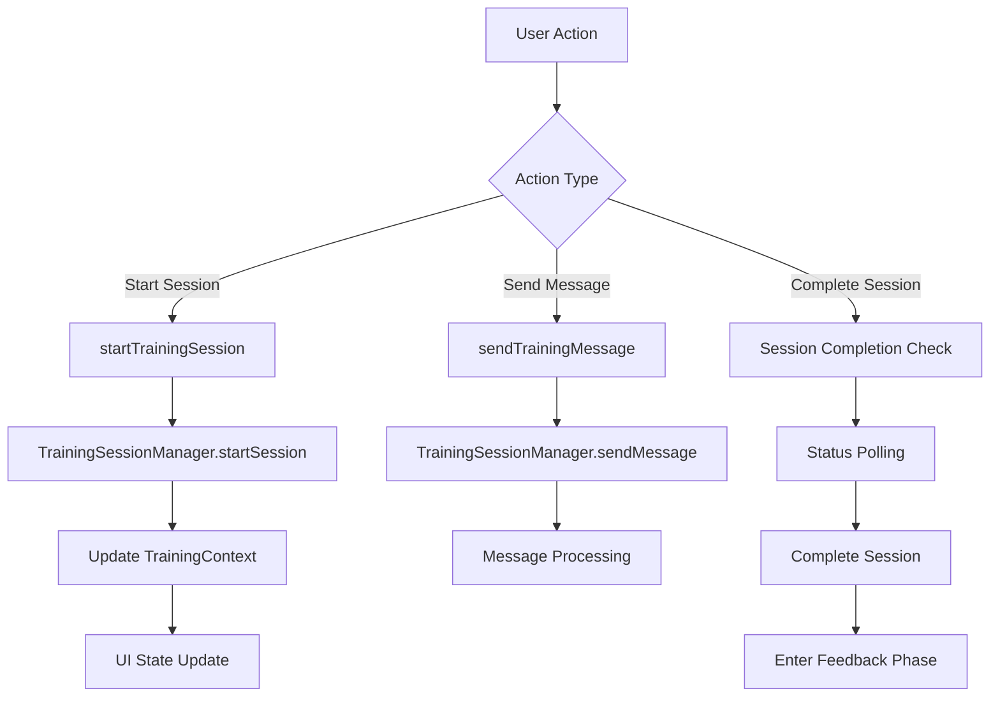

## Key Functions and Their Interactions

### 1. startTrainingSession()
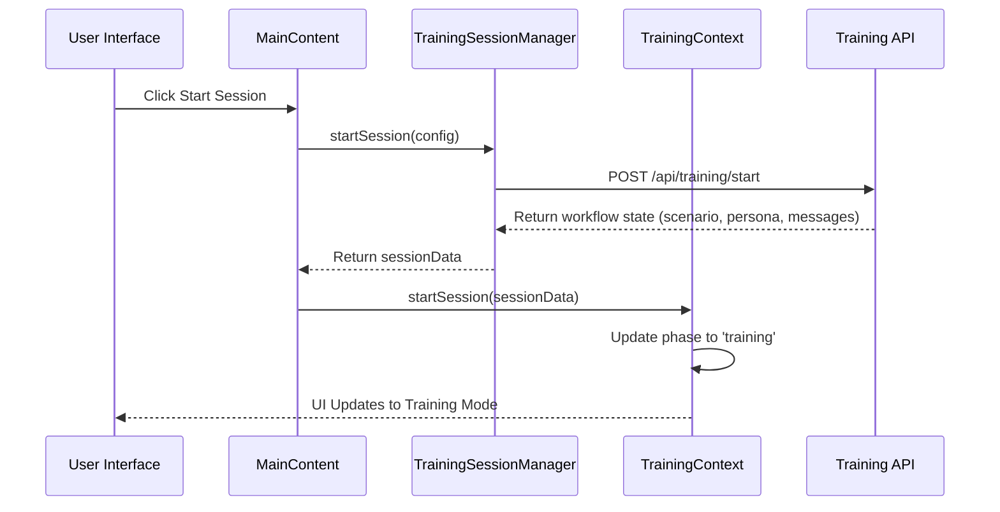

### 2. sendTrainingMessage()
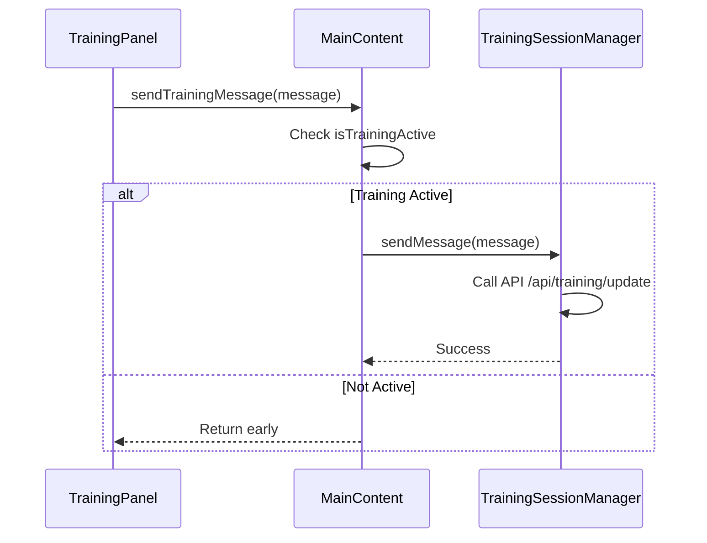

### 3. Session Status Polling
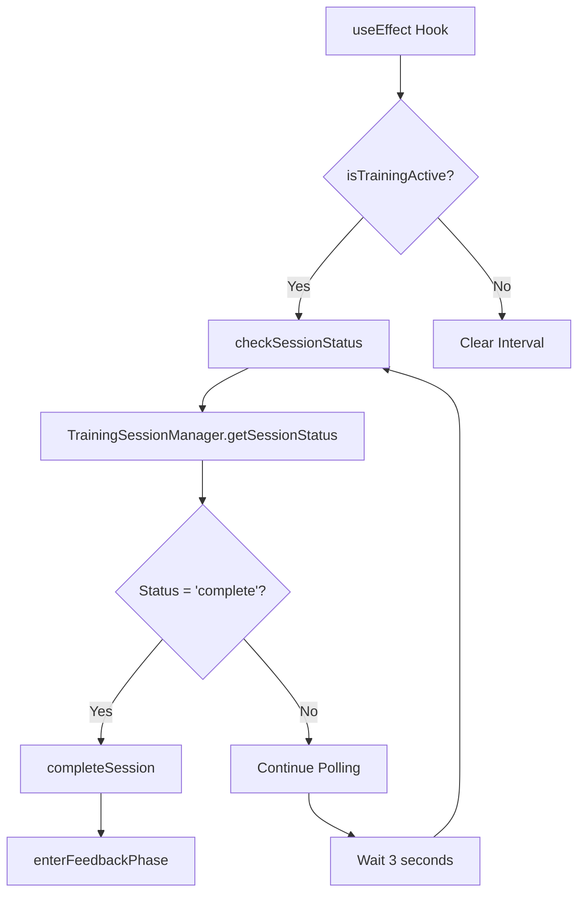

## UI State Management

### Panel Mode Management
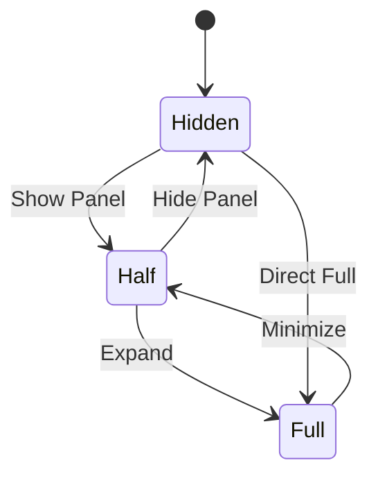

### Visual State Indicators
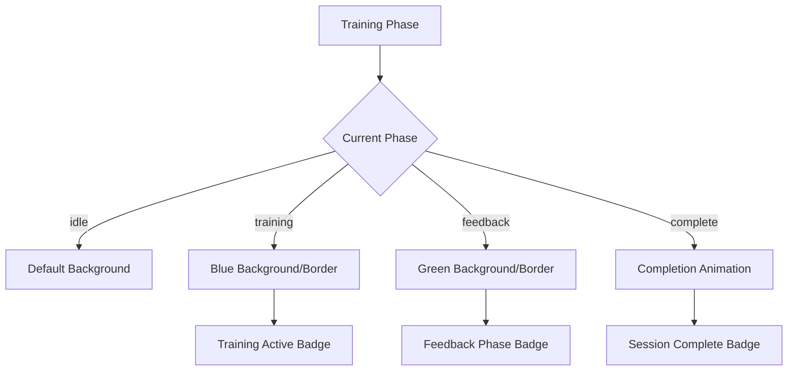

## Error Handling Strategy

### Error Flow
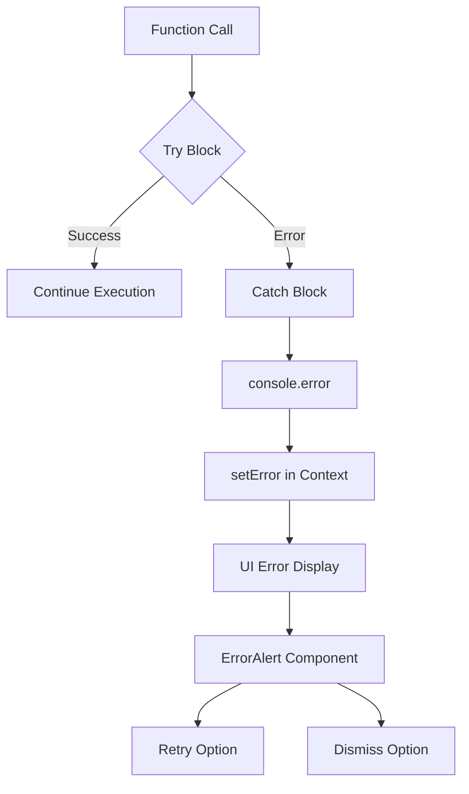

## Loading State Management

### Loading States Management
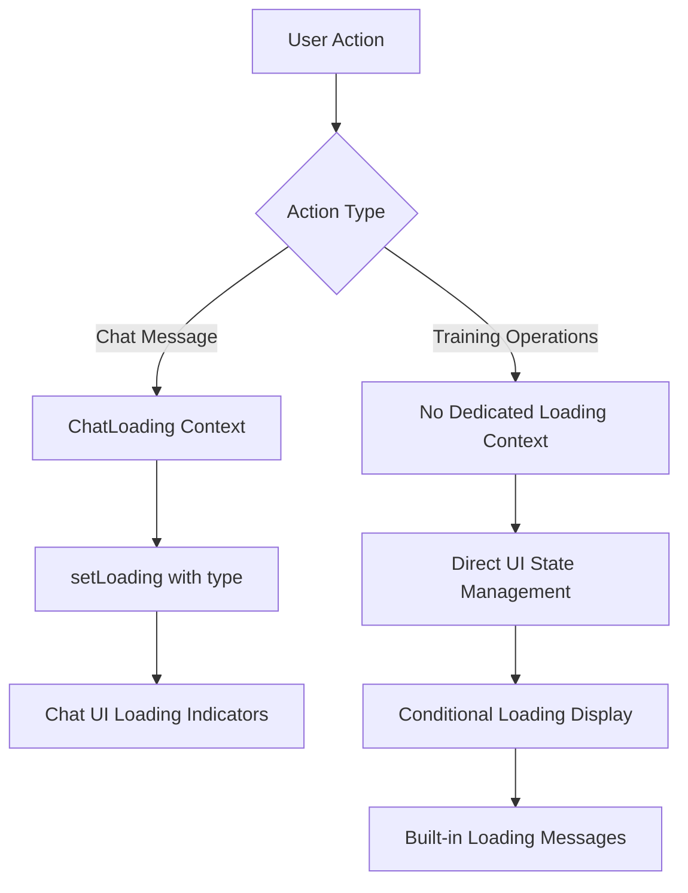

## Component Communication Patterns

### Parent-Child Communication
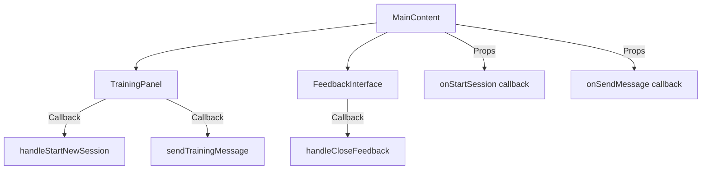

### Context-Based Communication
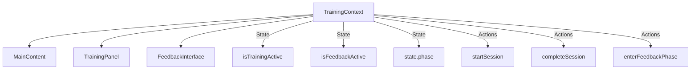

## Performance Optimizations

### useEffect Dependencies
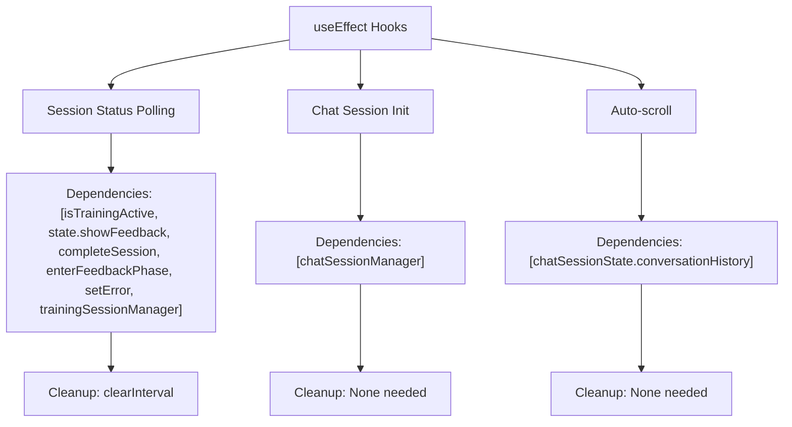

### Conditional Rendering Strategy
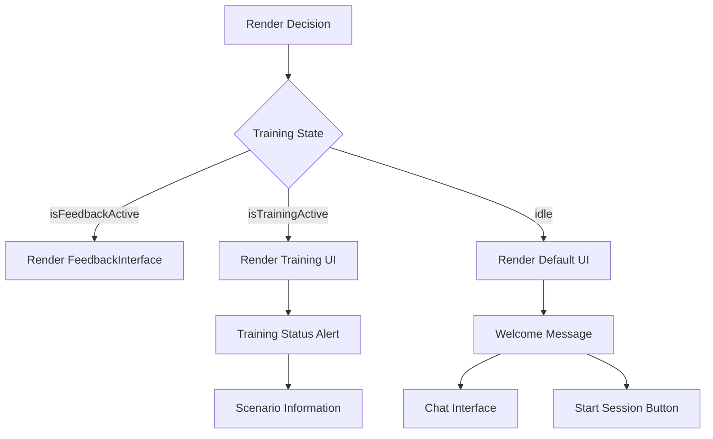

## Key Implementation Details

### 1. Session Manager Integration
- **Separation of Concerns**: Chat and Training managers are completely independent
- **State Synchronization**: Training manager state is synchronized with React context
- **Error Isolation**: Errors in one manager don't affect the other

### 2. Loading State Coordination
- **Multiple Loading Contexts**: Different loading states for different operations
- **Type-Safe Loading**: Loading states include operation type and custom messages
- **UI Feedback**: Loading states drive specific UI indicators and messages

### 3. Phase-Based UI Rendering
- **Conditional Styling**: Background colors and borders change based on training phase
- **Component Visibility**: Different components render based on current phase
- **State-Driven Badges**: Status badges reflect current training state

### 4. Event Handling Patterns
- **Async/Await**: All async operations use proper error handling
- **Early Returns**: Functions check preconditions before proceeding
- **State Validation**: UI state is validated before performing operations

## Testing Considerations

### Testable Units
1. **Individual Functions**: Each async function can be unit tested
2. **State Transitions**: Training phase transitions can be tested
3. **Error Handling**: Error scenarios can be simulated
4. **Loading States**: Loading state changes can be verified
5. **UI Rendering**: Conditional rendering can be tested

### Mock Points
1. **Session Managers**: Can be mocked for isolated testing
2. **Context Providers**: Can provide test state
3. **API Calls**: Underlying API calls can be mocked
4. **Timers**: Polling intervals can be mocked

This architecture provides a robust, maintainable, and testable foundation for the AI Training Simulator application.