# TrainingPanel.tsx Documentation

## Overview
The `TrainingPanel.tsx` component serves as the primary interface for training session interactions. It implements State Management, Polling Pattern, and Conditional Rendering patterns. **Note: The component has been simplified and some features like TrainingInput, ProgressIndicator, and comprehensive error handling have been removed or commented out.**

## Architecture Overview

### Component Structure
```mermaid
graph TB
    A[TrainingPanel] --> B[Header Section]
    A --> C[Scenario Info Section]
    A --> D[Scores Section]
    A --> E[Status Messages]
    
    B --> B1[Panel Title]
    B --> B2[Status Badge]
    B --> B3[Session Timer]
    B --> B4[Frozen Alert]
    
    C --> C1[Scenario Title]
    C --> C2[Scenario Description]
    C --> C3[Persona Badge]
    
    D --> D1[Overall Score]
    D --> D2[Policy Score]
    D --> D3[Empathy Score]
    
    E --> E1[Session Complete Alert]
    E --> E2[Loading Skeleton]
    
    Note: Input Area and Progress Section are commented out
```

## Design Patterns Implemented

### 1. State Management Pattern
The component uses simplified state management:

```mermaid
graph TB
    A[TrainingPanel State] --> B[Local State]
    A --> C[Context State]
    A --> D[Manager State]
    
    B --> B1[sessionStatus: SessionStatus]
    B --> B2[error: string - unused]
    B --> B3[isPolling: boolean]
    
    C --> C1[Training Context State Only]
    
    D --> D1[TrainingSessionManager]
    
    Note: TrainingLoadingContext removed
```

### 2. Polling Pattern Implementation
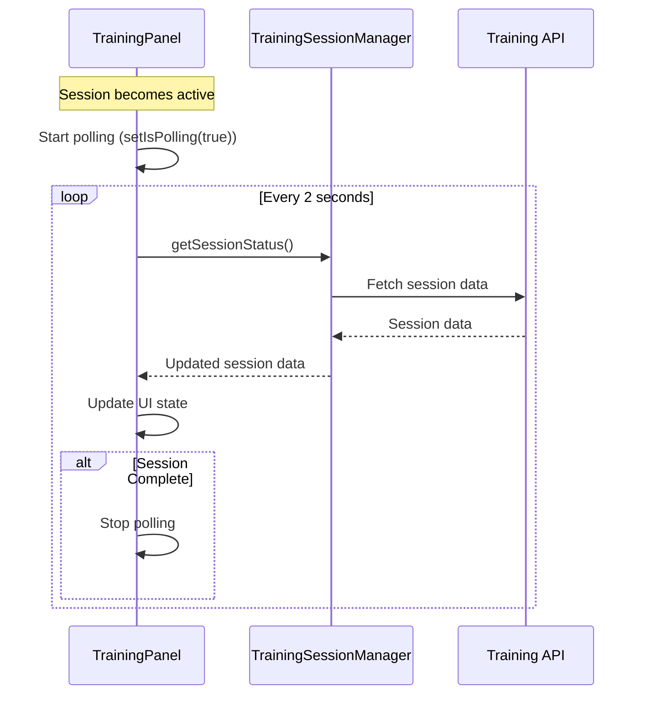

### 3. Error Handling Strategy
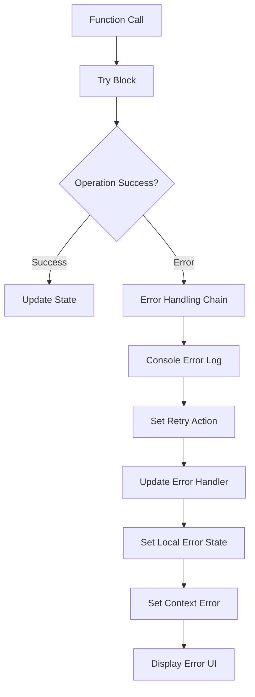

## Component Lifecycle and State Flow

### Component Initialization Flow
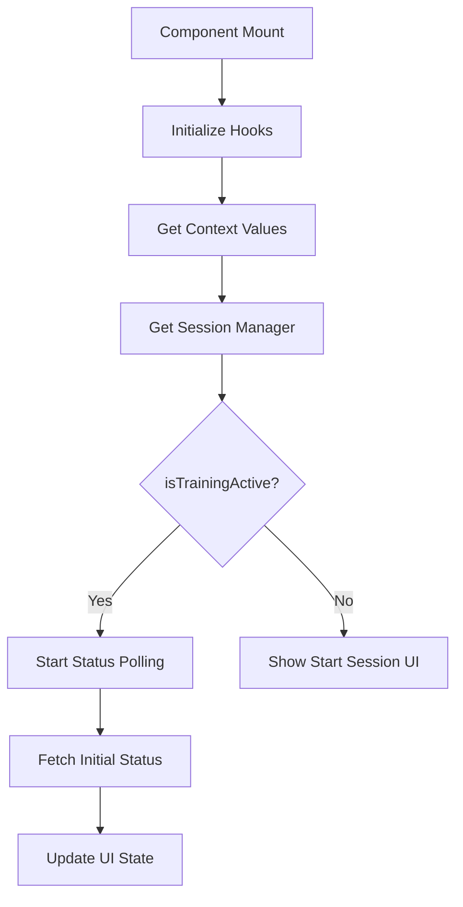

### State Transition Diagram
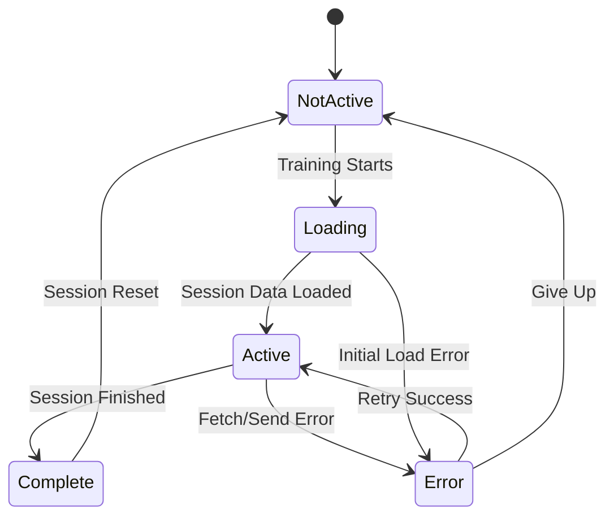

## Key Functions and Their Interactions

### 1. fetchSessionStatus()
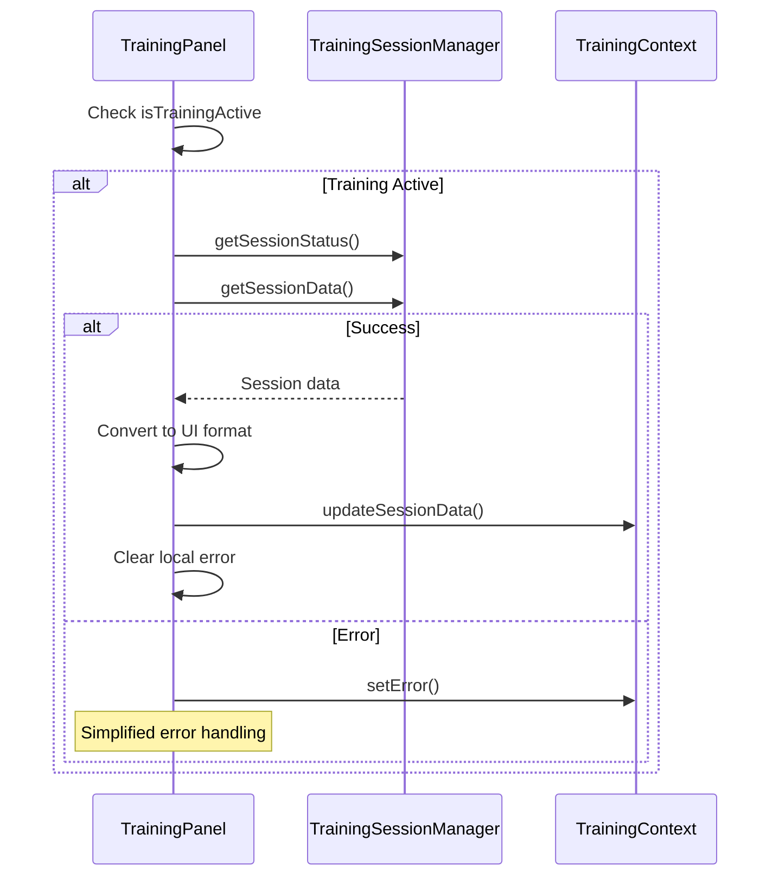

### 2. handleSendMessage() - Currently Unused
```mermaid
graph TB
    A[Function Defined] --> B[Not Connected to UI]
    
    B --> C[Would validate isTrainingActive]
    C --> D[Would call TrainingSessionManager.sendMessage]
    D --> E[Would call parent callback]
    E --> F[Would schedule status refresh]
    
    Note: This function exists but TrainingInput component is not rendered
```

### 3. Polling Management
```mermaid
graph TB
    A[useEffect: Polling] --> B{isTrainingActive && isPolling?}
    
    B -->|Yes| C[setInterval(fetchSessionStatus, 2000)]
    B -->|No| D[No Polling]
    
    C --> E[Return Cleanup Function]
    E --> F[clearInterval]
    
    G[useEffect: Session State] --> H{isTrainingActive?}
    H -->|Yes| I[fetchSessionStatus + setIsPolling(true)]
    H -->|No| J[setIsPolling(false) + clear status]
    
    K[useEffect: Session Complete] --> L{sessionStatus === 'complete'?}
    L -->|Yes| M[setIsPolling(false)]
    L -->|No| N[Continue Polling]
```

## UI Rendering Logic

### Conditional Rendering Strategy
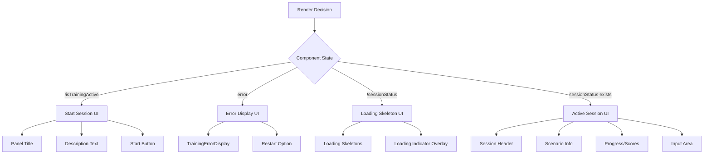

### Panel Variant System
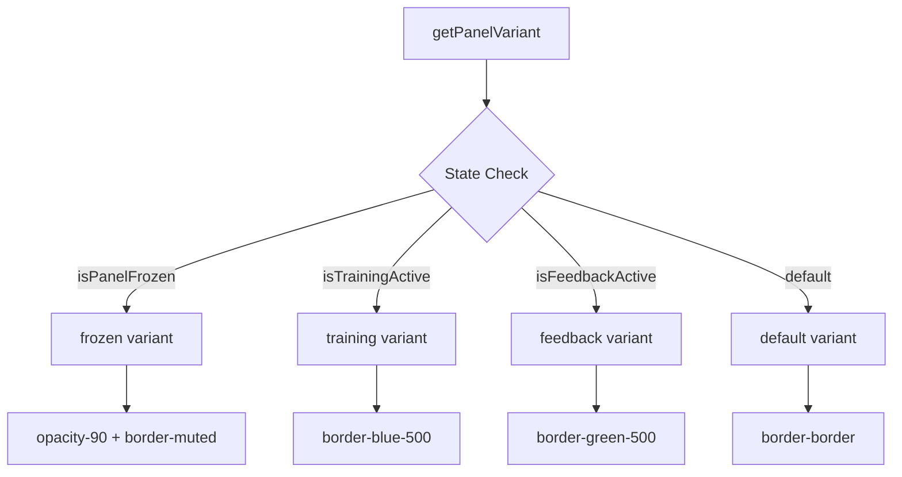

## Data Flow and Transformations

### Session Data Transformation
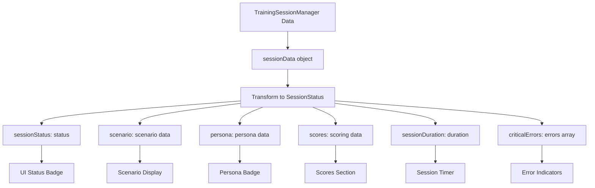

### Context Synchronization
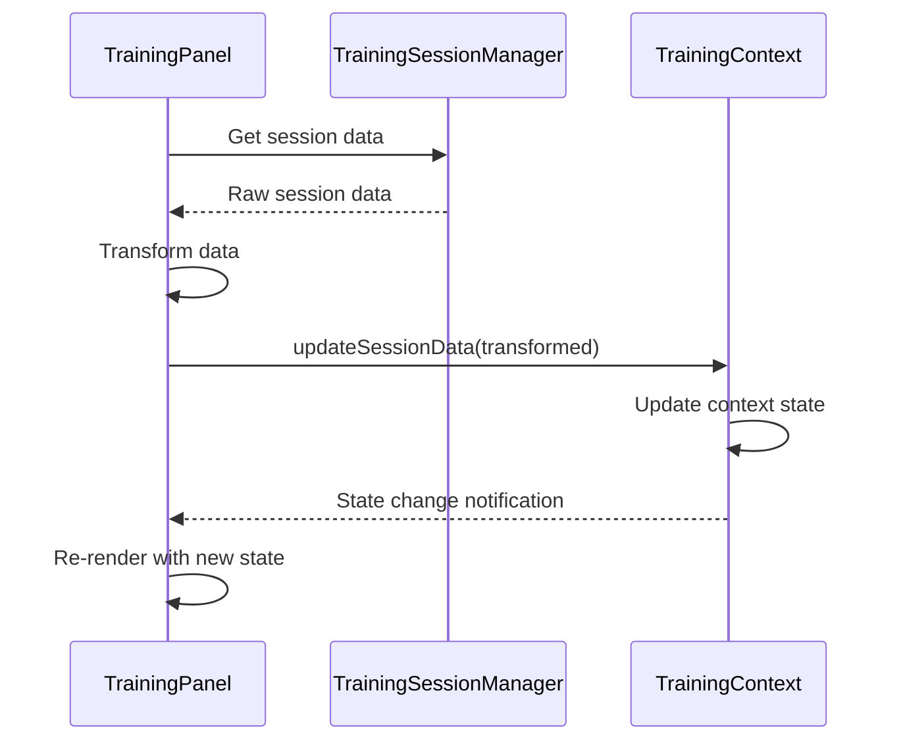

## Error Handling Implementation

### Error Handler Integration
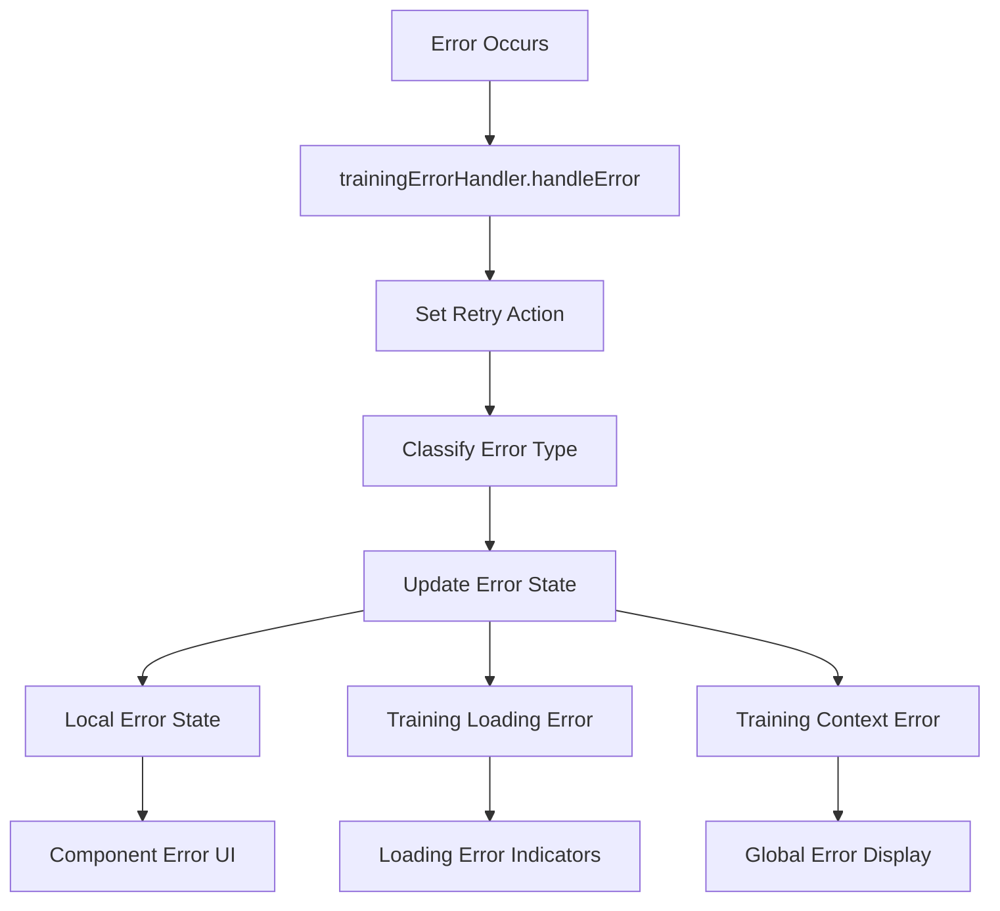

### Retry Mechanism
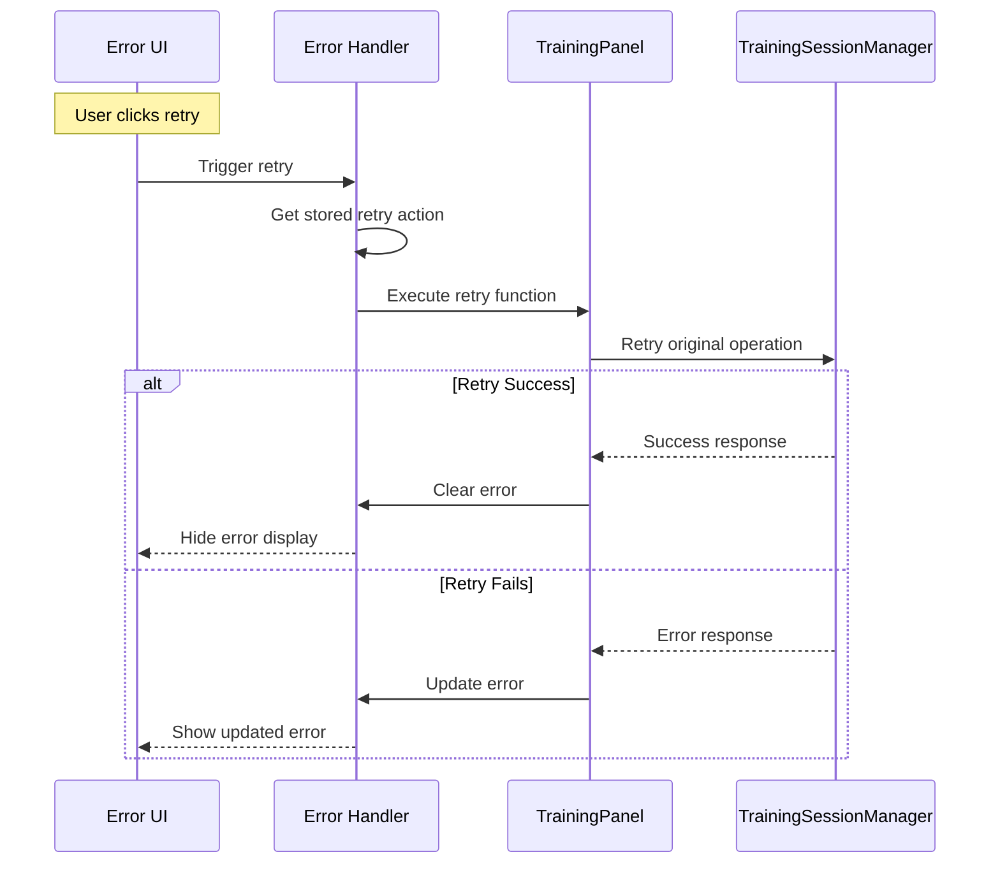

## Performance Optimizations

### useCallback Dependencies
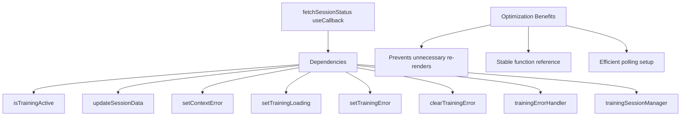

### Conditional Effect Execution
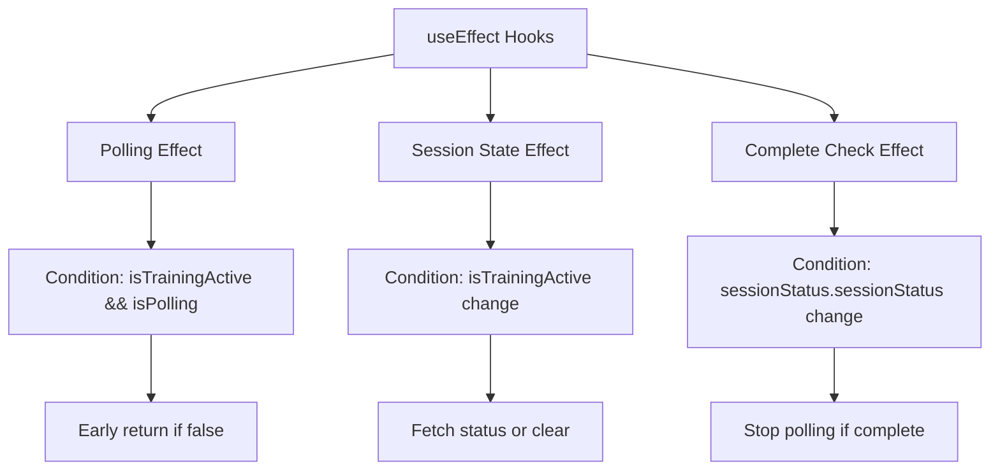

## Component Communication Patterns

### Props Interface
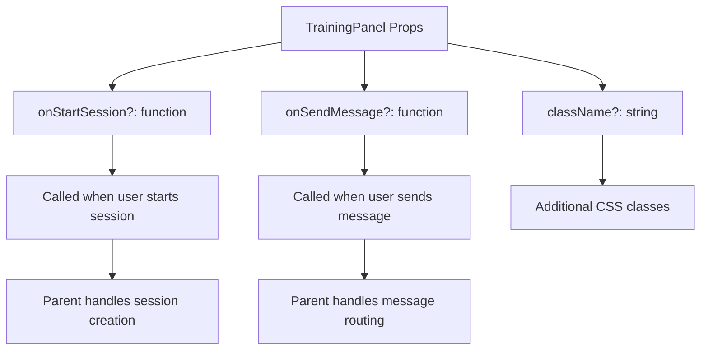

### Context Dependencies
```mermaid
graph TB
    A[TrainingPanel] --> B[useTraining Hook Only]
    
    B --> B1[state: TrainingUIState]
    B --> B2[updateSessionData: function]
    B --> B3[setError: function]
    B --> B4[panelTitle: string]
    B --> B5[isTrainingActive: boolean]
    B --> B6[isFeedbackActive: boolean]
    
    Note: TrainingLoadingContext dependency removed
```

## UI State Management

### Loading States
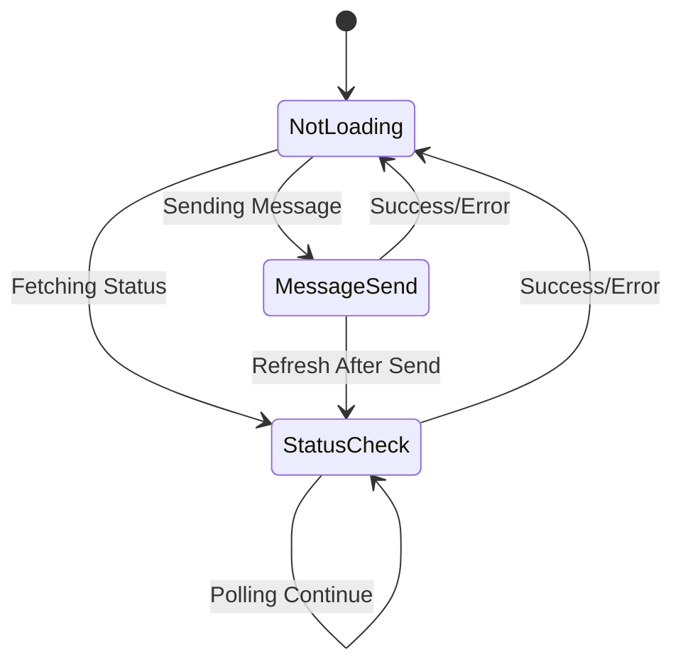

### Visual State Indicators
```mermaid
graph TB
    A[Visual Indicators] --> B[Status Badge]
    A --> C[Panel Border]
    A --> D[Loading Overlays]
    A --> E[Alert Messages]
    
    B --> B1[Active/Complete/Creating/Frozen]
    C --> C1[Blue: Training / Green: Feedback / Gray: Default]
    D --> D1[Skeleton Loading / Spinner Overlay]
    E --> E1[Frozen Panel / Session Complete]
```

## Testing Strategy

### Testable Components
1. **State Management**: Local state updates and context interactions
2. **Polling Logic**: Interval setup, cleanup, and condition checking
3. **Error Handling**: Error scenarios and retry mechanisms
4. **UI Rendering**: Conditional rendering based on state
5. **User Interactions**: Button clicks and message sending

### Mock Requirements
```mermaid
graph TB
    A[Test Mocks] --> B[TrainingSessionManager]
    A --> C[Context Providers]
    A --> D[Timer Functions]
    A --> E[Error Handler]
    
    B --> B1[Mock session operations]
    C --> C1[Mock context state/actions]
    D --> D1[Mock setInterval/clearInterval]
    E --> E1[Mock error handling logic]
```

### Test Scenarios
1. **Happy Path**: Normal session flow from start to completion
2. **Error Scenarios**: Network errors, session failures, retry logic
3. **Loading States**: Various loading states and transitions
4. **Edge Cases**: Rapid state changes, component unmounting during operations
5. **User Interactions**: Input validation, disabled states, callback execution

## Key Implementation Insights

### 1. Separation of Concerns
- **UI Logic**: Handled within the component
- **Business Logic**: Delegated to TrainingSessionManager
- **State Management**: Coordinated through React Context
- **Error Handling**: Centralized through error handler utility

### 2. Robust Polling Implementation
- **Conditional Polling**: Only polls when training is active
- **Automatic Cleanup**: Proper interval cleanup on unmount/state change
- **Error Resilience**: Continues polling despite individual request failures

### 3. Progressive Enhancement
- **Graceful Degradation**: Shows appropriate UI for each state
- **Loading States**: Provides feedback during all async operations
- **Error Recovery**: Offers retry mechanisms for failed operations

### 4. Type Safety
- **Interface Definitions**: Clear TypeScript interfaces for all data structures
- **State Typing**: Strongly typed state management
- **Prop Validation**: Optional props with proper typing

This architecture ensures the TrainingPanel component is maintainable, testable, and provides a robust user experience for training session interactions.